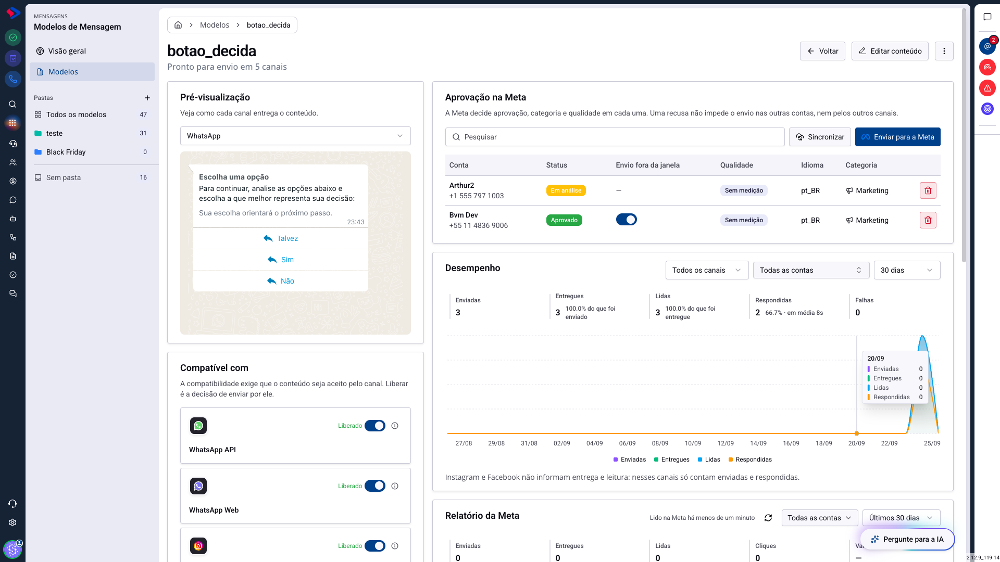
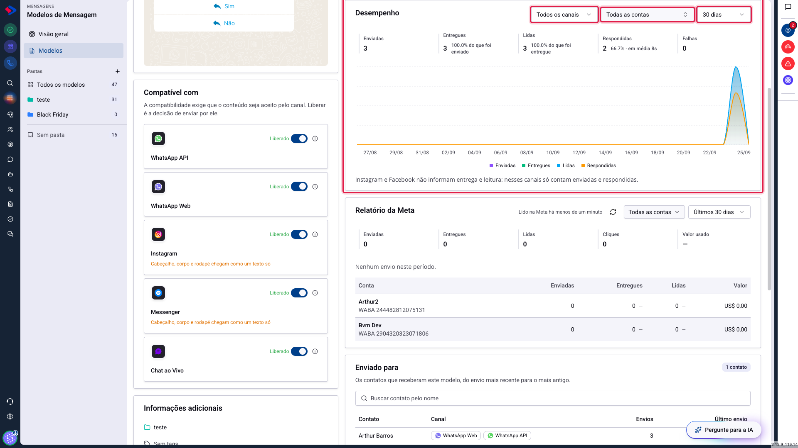
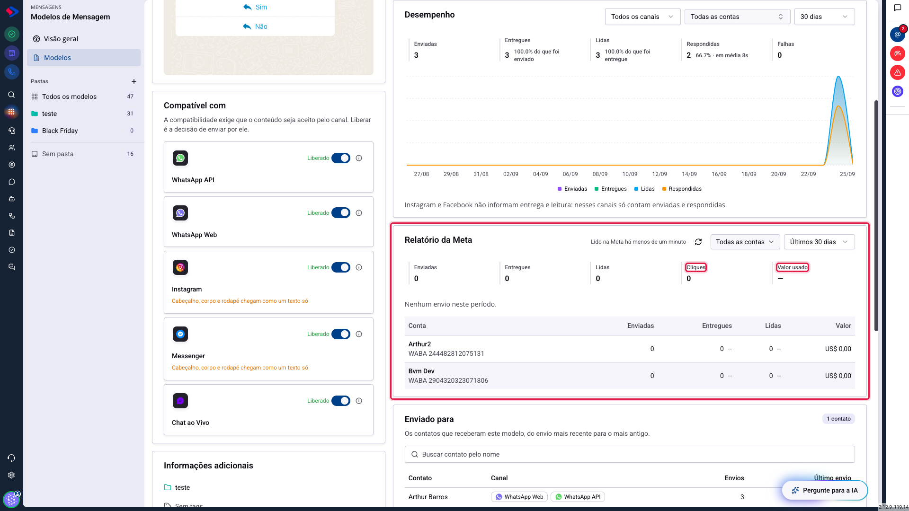
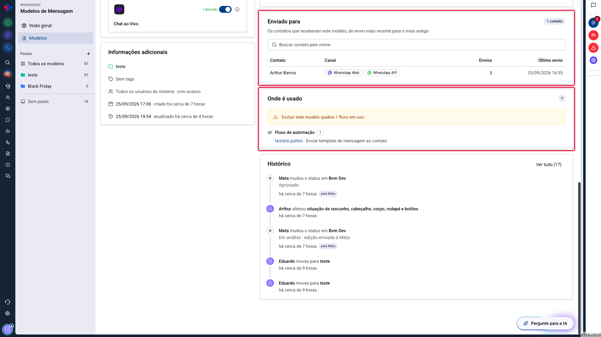
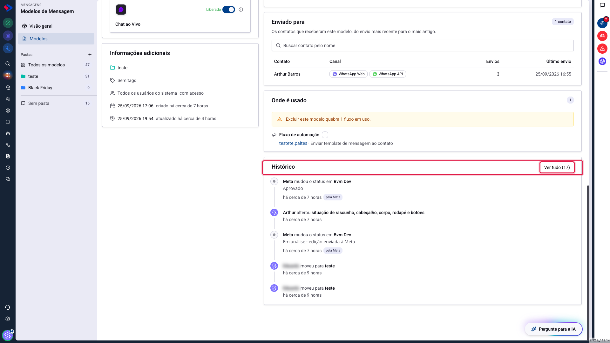
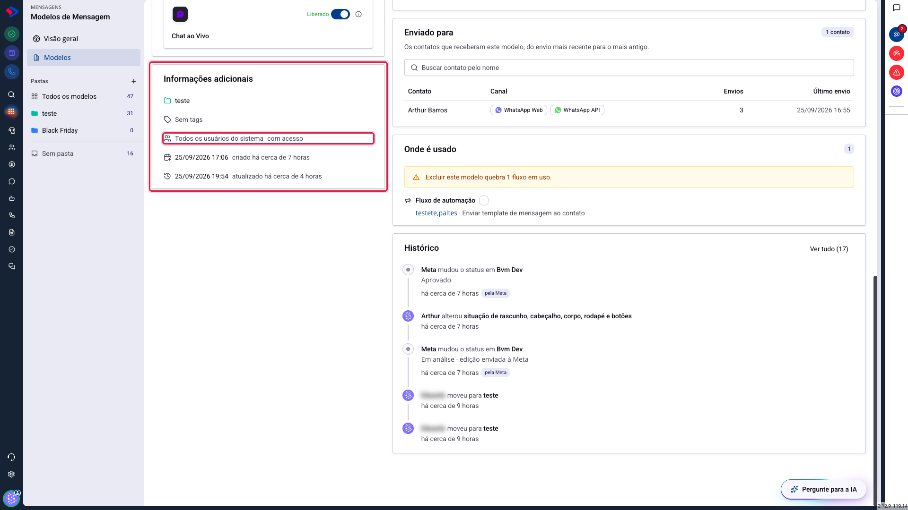

# A tela do modelo: tudo sobre um modelo em um lugar

Antes desta atualização, saber a situação de um modelo exigia abrir três telas: uma para o conteúdo, outra para a aprovação da Meta, outra para os números. A tela do modelo reúne isso, e acrescenta o que não existia em lugar nenhum.

Este artigo percorre os cartões dessa tela e explica o que cada um responde.

## Como acessar

Acesse **Menu >> Mensagens >> Modelos de Mensagem >> Modelos** e clique no nome de um modelo.

O subtítulo abaixo do nome resume a situação em uma linha: "Pronto para envio em 5 canais". As ações do topo são **Editar conteúdo**, que abre o construtor, e o menu de três pontos, com as permissões de acesso e a exclusão.

A tela tem duas colunas. À esquerda, o que o modelo **é**: prévia, compatibilidade e informações de cadastro. À direita, o que aconteceu com ele: aprovação, desempenho, custo, contatos, usos e histórico.

## Desempenho: como as mensagens se saíram

Este cartão conta o que saiu deste modelo, nos cinco canais.

Os três seletores do topo recortam tudo o que está abaixo: **canal**, **conta** e **período**. Os números e o gráfico mudam juntos, então não há risco de comparar um cartão filtrado com outro que não está.

**Enviadas** é quanta mensagem saiu a partir deste modelo. **Entregues** e **Lidas** vêm com a porcentagem sobre a etapa anterior. **Respondidas** traz a taxa e o tempo médio até a resposta, e é o número que mais diz sobre o conteúdo: modelo que ninguém responde costuma ser modelo que não pede nada. **Falhas** são os envios que não completaram.

O gráfico abaixo mostra os mesmos quatro números dia a dia, o que revela o que o total esconde: uma campanha concentrada em um dia, ou uma queda que começou numa data específica.

### Atenção: Instagram e Messenger não informam entrega e leitura

Esses dois canais não devolvem essa informação. Quando o filtro incluir um deles, as colunas de entrega e leitura contam menos do que a realidade, e a tela avisa isso logo abaixo do gráfico.

Para avaliar entrega e leitura com precisão, filtre por WhatsApp API ou WhatsApp Web.

## Relatório da Meta: o que custa dinheiro

O cartão seguinte mostra os números que **só a Meta tem**, e o principal deles é o custo.

Além de enviadas, entregues e lidas, aqui aparecem **Cliques**, que é quanta gente tocou nos botões, e **Valor usado**, que é quanto aquele modelo custou no período.

A tabela abaixo abre esses números por conta, porque a cobrança é por conta: o mesmo modelo pode custar em uma WABA e não custar em outra.

Ao lado do título fica quando o relatório foi lido na Meta pela última vez, com o botão de atualizar. Os dados não são ao vivo: eles vêm de uma consulta, e é normal que estejam algumas horas atrás dos números do cartão Desempenho.

### Por que os dois cartões podem discordar

**Desempenho** conta o que o SprintHub registrou, nos cinco canais. **Relatório da Meta** conta o que a Meta registrou, só no WhatsApp Oficial.

Se você vê 38 no primeiro e 0 no segundo, não é erro: provavelmente os envios saíram por WhatsApp Web ou Chat ao Vivo, que não passam pela Meta. E uma conta sem os relatórios da Meta ligados aparece zerada aqui, mesmo tendo enviado.

## Enviado para: quem recebeu

Este cartão lista os contatos que receberam o modelo, do envio mais recente para o mais antigo, com o canal usado, quantas vezes cada um recebeu e a data do último envio.

A busca por nome resolve a pergunta que costuma chegar ao suporte: "este cliente recebeu a mensagem?". Antes, era preciso abrir a conversa e rolar.

Repare em "quantas vezes": o mesmo contato receber o mesmo modelo várias vezes pode ser normal, num lembrete recorrente, ou pode ser uma automação disparando mais do que deveria.

## Onde é usado: o que quebra se você excluir

Este é o cartão que evita o acidente mais caro do módulo.

Um modelo raramente vive sozinho: ele é disparado por chatbots, automações de CRM e de atendimento, fluxos de campanha, agentes de IA, formulários, filas de mensagens, calendários públicos e agendamentos. Excluir o modelo quebra todos eles, em silêncio.

O cartão lista cada lugar, com link para abrir, e o aviso no topo diz o tamanho do estrago: **"Excluir este modelo quebra 1 fluxo em uso"**.

Cada tipo de uso tem uma consequência diferente, e vale conhecê-las:

| Onde é usado | O que acontece se o modelo sumir |
|---|---|
| Chatbots | o nó deixa de enviar |
| Automações de CRM e de atendimento | a ação falha ao executar |
| Fluxos de campanha | a ação da campanha falha |
| Agentes de IA | a ação do agente falha |
| Formulários | a ação do formulário falha |
| Filas de mensagens | a mensagem da fila para de sair |
| Calendários públicos | o aviso do agendamento para de sair |
| Mensagens agendadas | o envio marcado falha |
| Outros modelos que o usam como alternativo | o outro modelo perde a reserva |

Antes de excluir qualquer modelo, olhe este cartão. Se ele estiver vazio, pode excluir sem medo.

## Histórico: quem mudou o quê

O histórico registra cada alteração, com autor, data e o que mudou.

Ele registra tanto o que a sua equipe fez quanto **o que a Meta fez por conta própria**. As linhas marcadas como "pela Meta" são mudanças que ninguém no seu time pediu: uma aprovação, uma recusa, uma troca de categoria, uma pausa por qualidade.

Isso responde a pergunta que não tinha resposta antes: "por que este modelo parou de sair?". Muitas vezes a resposta está aqui, numa linha que diz que a Meta pausou o modelo há três dias.

O botão **Ver tudo** abre a lista completa, quando o cartão mostra só as últimas alterações.

## Informações adicionais

O cartão da coluna esquerda reúne o cadastro: a pasta onde o modelo está, as etiquetas, **quem tem acesso a ele**, e as datas de criação e da última atualização.

A linha de acesso costuma dizer "Todos os usuários do sistema", que é como todo modelo nasce. Quando alguém restringe o modelo a usuários ou departamentos, é aqui que isso aparece, sem precisar abrir o diálogo de permissões.

## Dica: comece pelo fim quando algo der errado

Quando um modelo "parou de funcionar", a ordem que mais resolve é esta: **Histórico** para ver se a Meta mexeu nele, **Aprovação na Meta** para ver o status de cada conta, e **Compatível com** para ver se uma edição recente derrubou o canal que você usava.

Os três respondem em segundos, e cobrem quase todos os casos que chegam ao suporte.

## Conclusão

A tela do modelo troca a pergunta "onde eu vejo isso?" por "o que eu quero saber?". Conteúdo e compatibilidade de um lado, resultado e histórico do outro.

Dos cartões, o **Onde é usado** é o que vale o hábito: consultá-lo antes de mexer ou excluir evita quebrar um fluxo que ninguém lembrava que existia.

Em caso de dúvidas, consulte os outros artigos sobre Modelos de Mensagem ou entre em contato com o suporte SprintHub.
