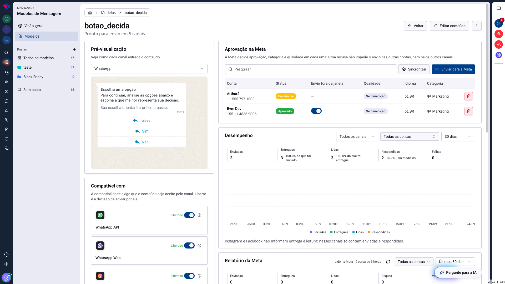
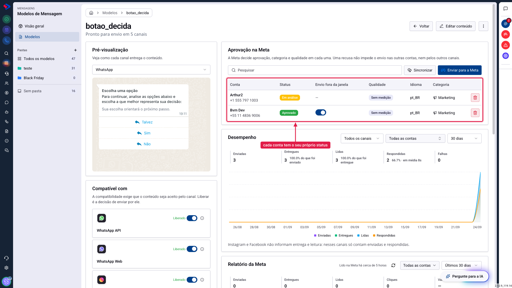
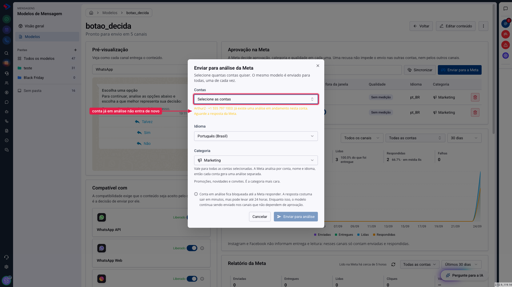
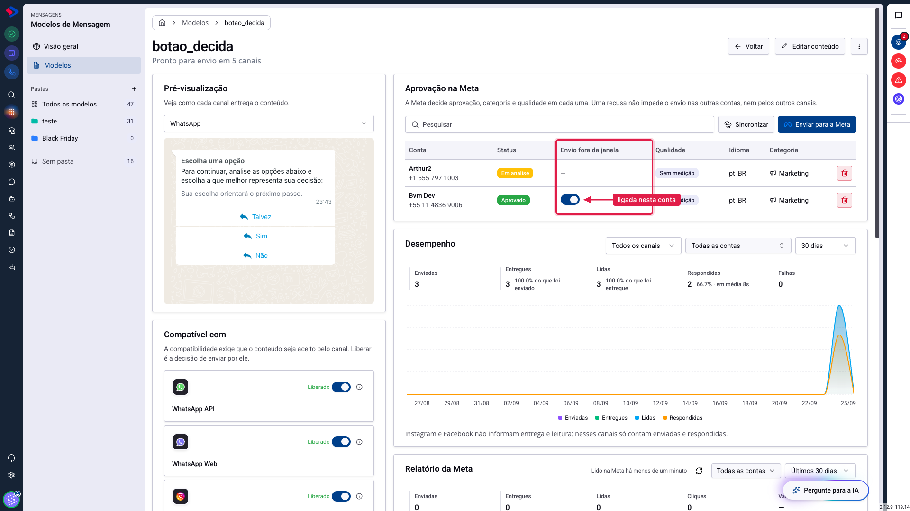

# Aprovação na Meta: por que agora é conta por conta

Se você usa o WhatsApp Oficial, já conhece o processo: para enviar uma mensagem fora da janela de 24 horas, o modelo precisa da aprovação da Meta.

O que mudou nesta atualização é que a aprovação deixou de ser uma propriedade do modelo e passou a ser uma propriedade de **cada conta**. O mesmo modelo pode estar aprovado numa conta e reprovado em outra, ao mesmo tempo, e isso é normal.

Este artigo explica como isso funciona na prática, como pedir aprovação e o que fazer quando a Meta recusa.

## Como acessar

Acesse **Menu >> Mensagens >> Modelos de Mensagem**, clique em **Modelos** e depois no nome do modelo.

O cartão **Aprovação na Meta** fica na coluna da direita, logo abaixo do título.

## Por que a aprovação é por conta?

Quem aprova é a Meta, e ela analisa cada conta separadamente. Para ela, o mesmo texto enviado por duas contas diferentes são dois pedidos diferentes, que podem ter respostas diferentes.

Antes, o sistema guardava uma aprovação só por modelo, o que obrigava a manter cópias do mesmo conteúdo quando você tinha mais de uma conta. Agora o modelo é um só, e cada conta tem a sua linha na tabela.

No exemplo acima, o mesmo modelo está **aprovado** numa conta e **em análise** em outra. As duas situações convivem, e o envio já funciona pela conta aprovada enquanto a outra espera resposta.

**Uma recusa não contamina o resto.** Se a Meta reprovar numa conta, as outras continuam valendo, e os canais que não dependem de aprovação (WhatsApp Web, Instagram, Messenger e Chat ao Vivo) seguem enviando normalmente.

## O que cada coluna mostra

**Conta**: o nome que você cadastrou e o número de telefone. O número aparece porque o nome costuma se repetir ("Vendas", "Suporte") e é pelo telefone que a equipe identifica a conta.

**Status**: a situação naquela conta. Pode ser Aprovado, Em análise, Reprovado, ou vazio quando o modelo nunca foi enviado para lá.

**Envio fora da janela**: a chave que autoriza usar aquele modelo para reabrir conversa depois das 24 horas. Ela só faz sentido em conta aprovada.

**Qualidade**: a nota que a Meta dá ao modelo com base em como os contatos reagem. Aparece como "Sem medição" enquanto não houver volume suficiente.

**Idioma** e **Categoria**: o que foi declarado no pedido. A Meta aprova por conta, nome e idioma, então o mesmo modelo em dois idiomas gera dois pedidos.

## Como pedir aprovação

Clique em **Enviar para a Meta**, no topo do cartão.

O diálogo pede três coisas:

**Contas**: escolha quantas quiser. O mesmo modelo é enviado para todas, uma de cada vez. Contas que já estão com uma análise em andamento aparecem bloqueadas, com o aviso do motivo.

**Idioma**: o idioma em que o conteúdo está escrito. Não é tradução, é declaração: a Meta usa isso para separar as análises.

**Categoria**: para que serve a mensagem. Escolher certo importa no bolso, porque as categorias têm custos diferentes, e Marketing é a mais cara.

| Categoria | Quando usar |
|---|---|
| **Marketing** | promoções, novidades e convites |
| **Utilidade** | confirmações, atualizações de pedido, lembretes |
| **Autenticação** | códigos de verificação |

## A chave de envio fora da janela de 24h

No WhatsApp Oficial existe uma janela: depois da última mensagem do contato, você responde livremente por 24 horas. Passado esse prazo, a conversa fecha, e só um modelo aprovado reabre.

Reabrir conversa **custa dinheiro**: fora da janela, a Meta cobra por mensagem. Por isso existe a coluna **Envio fora da janela**, que autoriza ou não cada modelo a fazer isso.

A chave é **por conta**, e não por modelo. A Meta aprova por conta e cobra por conta, então a mesma mensagem pode ser livre em uma e restrita em outra.

Três situações aparecem nessa coluna:

**Chave ligada**: o modelo pode reabrir conversa por aquela conta. É como todo modelo começa, para não interromper quem já enviava.

**Chave desligada**: o modelo só sai dentro da janela. Serve para mensagens que só fazem sentido como resposta, como um aviso de senha ou a confirmação de um agendamento que o contato acabou de pedir.

**Um traço no lugar da chave**: não há aprovação naquela conta, então a chave não mudaria nada. Sem aprovação, o envio já é recusado fora da janela de qualquer forma.

Ao desligar a chave, uma situação passa a ser recusada: quando o sistema não consegue saber se a janela está aberta. É proposital, e a razão é o bolso: quem restringiu não quer envio no escuro, e uma mensagem a mais custa dinheiro enquanto uma recusa apenas devolve um erro visível.

### Dica: combine a chave com o modelo alternativo

A chave decide se **este** modelo reabre conversa. O campo **Modelo alternativo**, no construtor, decide **qual** modelo responde quando a janela fecha.

Usados juntos, eles dão o desenho que a maioria das operações quer: as mensagens do dia a dia com a chave desligada, e um modelo aprovado de retomada escolhido como alternativo, que é o único autorizado a custar dinheiro.

## Atenção: a conta fica bloqueada durante a análise

Enquanto a Meta não responde, aquela conta não aceita um novo pedido para o mesmo modelo. A resposta costuma sair em minutos, mas a Meta pode levar até 24 horas.

Isso não paralisa o modelo: enquanto a análise corre, ele continua sendo enviado normalmente nos canais que não dependem de aprovação, e nas contas que já estão aprovadas.

## O que faz o botão Sincronizar

A Meta pode mudar a situação de um modelo sem avisar: aprovar, reprovar, pausar por qualidade ou até trocar a categoria que você declarou.

**Sincronizar** vai até a Meta e traz a situação atual de todas as contas. Use quando desconfiar que a tela está desatualizada, ou depois de fazer um pedido e querer saber se já saiu a resposta.

## E se a Meta reprovar?

A recusa aparece no status da conta, e o motivo informado pela Meta fica registrado na tela do modelo.

Os motivos mais comuns são conteúdo que parece promocional numa categoria de utilidade, variáveis sem exemplo claro, e links encurtados. Ajuste o conteúdo e envie de novo: cada novo pedido é uma análise nova.

**Reprovado numa conta não quer dizer reprovado em todas.** Vale conferir a tabela antes de refazer o modelo inteiro: às vezes o problema é de uma conta só.

## Dica: importe o que já existe na Meta

Se você já tinha modelos aprovados na Meta antes de usar o SprintHub, não precisa recriá-los. Na lista de modelos, o botão **Importar da Meta** traz os que já existem lá para o seu catálogo.

## Conclusão

A aprovação por conta parece mais trabalho, mas é o que corresponde ao funcionamento real da Meta, e o que permite manter um modelo só em vez de uma cópia por conta.

Na prática, o fluxo é: escreva o conteúdo, envie para análise nas contas que vão usar aquele modelo, e acompanhe a tabela. Enquanto isso, os canais que não dependem da Meta já podem enviar.

Em caso de dúvidas, consulte os outros artigos sobre Modelos de Mensagem ou entre em contato com o suporte SprintHub.
