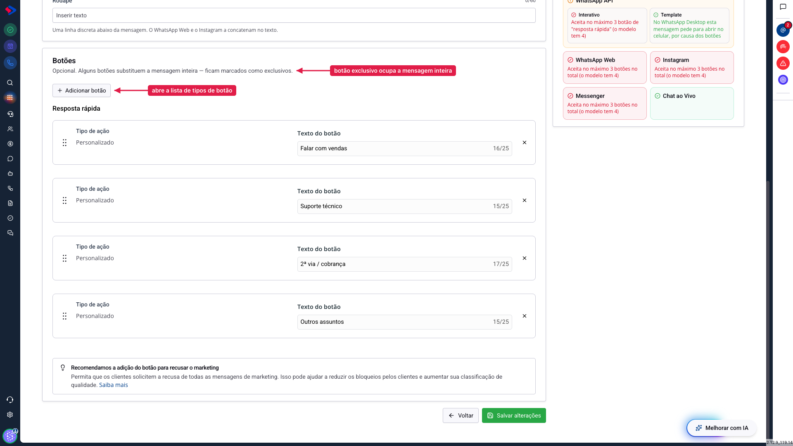
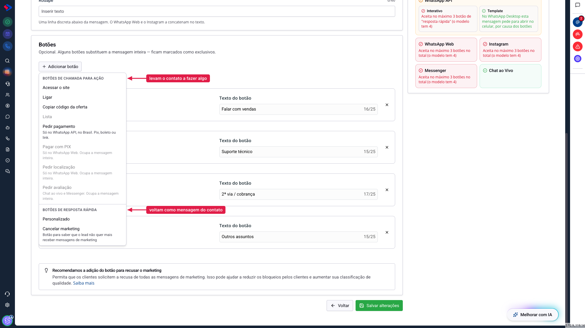
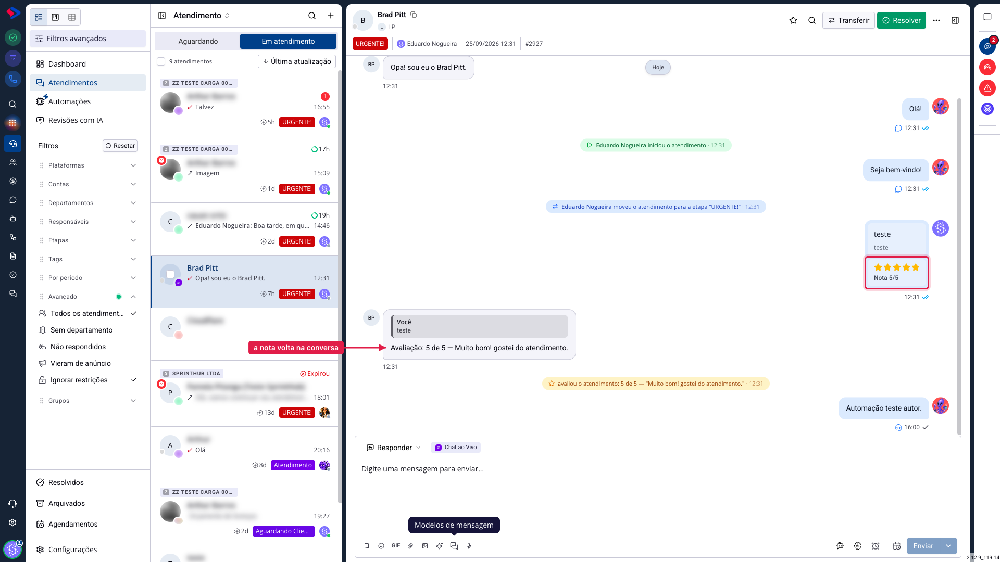
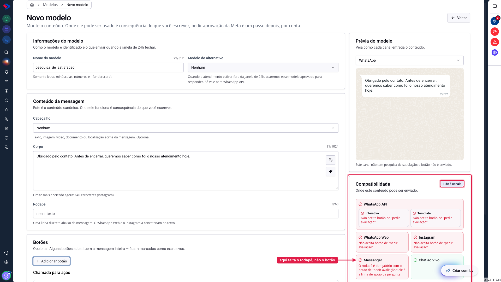

# Os botões dos Modelos de Mensagem

Um modelo pode ter botões, e eles são o que transforma uma mensagem em conversa: o contato toca e responde, acessa um site, liga, paga ou avalia o atendimento.

A atualização trouxe quatro botões que não existiam: pedir pagamento, pagar com PIX, pedir localização e pedir avaliação. Este artigo explica todos os tipos, em qual canal cada um funciona, e por que alguns deles derrubam os outros canais quando você os adiciona.

## Como acessar

Acesse **Menu >> Mensagens >> Modelos de Mensagem >> Modelos** e clique em **Novo modelo**, ou abra um modelo existente e clique em **Editar conteúdo**.

A seção **Botões** fica abaixo do conteúdo da mensagem.

Repare no aviso: alguns botões substituem a mensagem inteira e ficam marcados como exclusivos. Voltaremos a isso.

## Os tipos disponíveis

Clique em **Adicionar botão** para ver a lista.

Eles são separados em dois grupos, e a diferença importa:

**Botões de chamada para ação** levam o contato para algum lugar ou pedem alguma coisa a ele. Acessar o site, ligar, copiar código da oferta, lista, e os quatro novos.

**Botões de resposta rápida** funcionam como respostas prontas: o contato toca e aquilo volta como mensagem dele para você. São o "Personalizado", em que você escreve o texto, e o "Cancelar marketing", que serve para o contato pedir para não receber mais promoções.

### Os botões que já existiam

**Acessar o site** abre um endereço. Aceita variáveis, então dá para montar um link diferente por contato.

**Ligar** abre o discador com o número que você configurar.

**Copiar código da oferta** mostra um cupom que o contato copia com um toque. É recurso de template de marketing.

**Lista** apresenta várias opções em uma folha que abre por cima da conversa, útil quando são muitas alternativas para caber em três botões.

**Cancelar marketing** registra que aquele contato não quer mais mensagens promocionais. A própria tela recomenda incluí-lo em campanhas: ele reduz bloqueios e ajuda a manter a qualidade do seu número na Meta.

## Os quatro botões novos

### Pedir pagamento

Gera uma cobrança dentro da conversa, com Pix, boleto ou link de pagamento.

Funciona **só no WhatsApp API**, e só em contas do Brasil. Ele depende de aprovação da Meta: é recurso de template aprovado, e não funciona no envio interativo do dia a dia. Você pode ter até três botões desse tipo no mesmo modelo.

### Pagar com PIX

Manda o cartão de pagamento por Pix.

Funciona **só no WhatsApp Web** e **ocupa a mensagem inteira**: o texto que você escreveu no corpo não é enviado junto, o contato recebe só o cartão do Pix.

### Pedir localização

Pede que o contato compartilhe onde ele está, e a resposta chega como um mapa na conversa. Serve para confirmar endereço de entrega ou achar a unidade mais próxima.

Funciona **só no WhatsApp Web** e também ocupa a mensagem inteira.

### Pedir avaliação

Envia uma pesquisa de satisfação, e a nota do contato volta para o atendimento.

Funciona no **Chat ao Vivo** e no **Messenger**. Ao escolher esse botão, você decide o que medir:

| Escala | O que ela pergunta |
|---|---|
| **Satisfação, 1 a 5 estrelas** | o quanto o cliente gostou do atendimento |
| **Recomendação, 0 a 10 (NPS)** | o quanto ele recomendaria você a outra pessoa |
| **Esforço, 1 a 7 (CES)** | o quanto foi fácil resolver o problema dele |

No Messenger, **o rodapé passa a ser obrigatório** com esse botão: ele vira a linha de apoio da pergunta, e a Meta recusa o envio sem ele.

A nota chega na própria conversa, junto do comentário que o contato deixar:

Além da bolha na conversa, a avaliação fica registrada na linha do tempo do atendimento, e pode ser acompanhada depois.

## Atenção: botão exclusivo derruba os outros canais

Alguns botões substituem a mensagem inteira e, por isso, não convivem com canal nenhum além do seu. A tela chama esses de **exclusivos**, e são três: pagar com PIX, pedir localização e pedir avaliação.

O efeito é imediato, e vale ver antes de salvar. Abaixo, um modelo que servia os cinco canais passou a servir um só depois que o botão de avaliação entrou:

Repare que cada canal explica o que aconteceu. O Messenger não diz que o botão é incompatível: diz que falta o rodapé, que é exigência da Meta para esse formato. Preenchendo o rodapé, ele volta para a lista.

A prévia também avisa, no alto da tela: "Este canal não tem pesquisa de satisfação: o botão não é enviado".

## Quantos botões cabem em cada canal

| Botão | WhatsApp API (interativo) | WhatsApp Web | Instagram | Messenger | Chat ao Vivo | Template aprovado |
|---|---|---|---|---|---|---|
| Resposta rápida | 3 | 3 | 3 | 3 | 10 | 10 |
| Lista de opções | 1 | 1 | — | — | 1 | — |
| Acessar site | 1 | 3 | 3 | 3 | 3 | 2 |
| Ligar | — | 1 | — | 1 | 1 | 1 |
| Cancelar promoções | — | 1 | — | 1 | — | 1 |
| Copiar cupom | — | 3 | — | — | 1 | 1 |
| Pagar com PIX | — | 1 | — | — | — | — |
| Pedir localização | — | 1 | — | — | — | — |
| Pedir avaliação | — | — | — | 1 | 1 | — |
| Pedir pagamento | — | — | — | — | — | 3 |

WhatsApp Web, Instagram e Messenger aceitam no máximo três botões no total, somando todos os tipos.

## Como decidir qual usar

| Você quer | Use | Canal |
|---|---|---|
| Uma resposta simples do contato | Personalizado | todos |
| Levar para uma página | Acessar o site | todos |
| Receber ligação | Ligar | WhatsApp Web, Messenger, Chat ao Vivo |
| Entregar um cupom | Copiar código da oferta | WhatsApp Web, Chat ao Vivo |
| Receber um pagamento com Pix, boleto ou link | Pedir pagamento | WhatsApp API, com aprovação |
| Mandar um Pix direto na conversa | Pagar com PIX | WhatsApp Web |
| Saber onde o contato está | Pedir localização | WhatsApp Web |
| Medir a satisfação do atendimento | Pedir avaliação | Chat ao Vivo e Messenger |

Se o canal que você usa não aparece na linha do botão que você quer, não adianta insistir: o botão não existe naquele canal, e o modelo não será enviado por ele.

## Dica: reordene arrastando

Os botões podem ser reordenados: arraste pelo ícone à esquerda de cada um. A ordem do construtor é a ordem em que o contato vê, e ela importa. A opção que você mais quer que seja escolhida deve vir primeiro.

## Conclusão

Os botões novos abrem possibilidades que antes exigiam mandar link solto ou pedir informação por texto. Em troca, três deles são exclusivos: escolhê-los é escolher um canal só.

Antes de montar um modelo com botão exclusivo, decida por qual canal aquela mensagem vai sair. Se você precisa da mesma ação em canais diferentes, o caminho é ter um modelo para cada.

Em caso de dúvidas, consulte os outros artigos sobre Modelos de Mensagem ou entre em contato com o suporte SprintHub.
