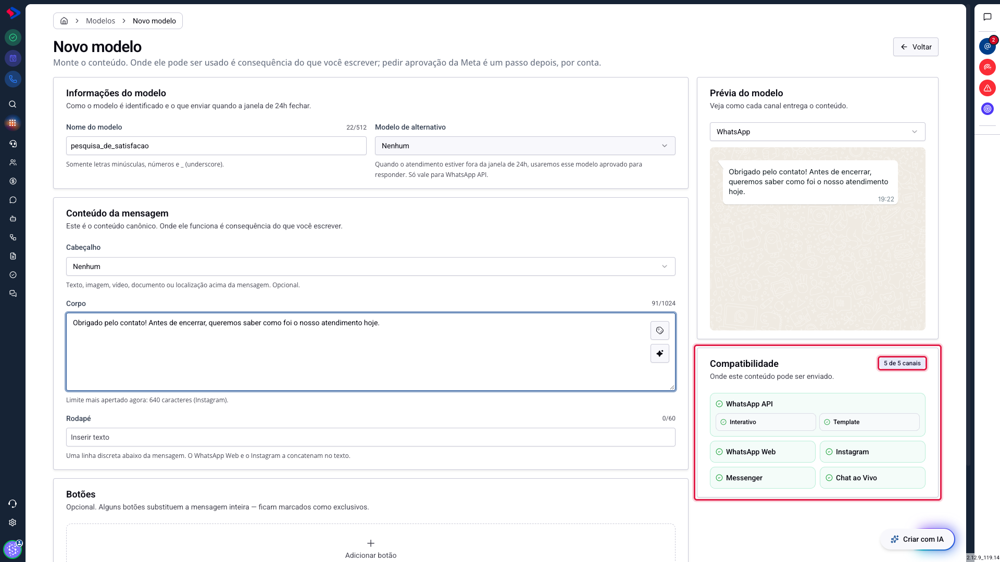
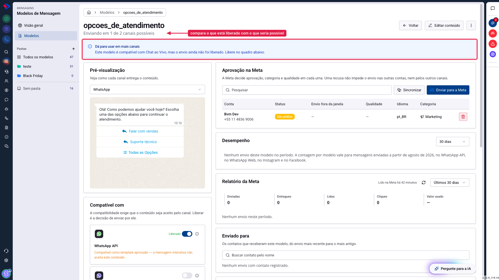
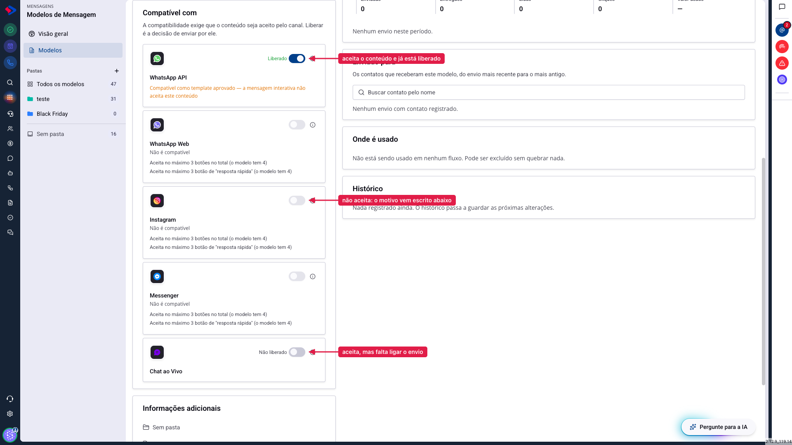
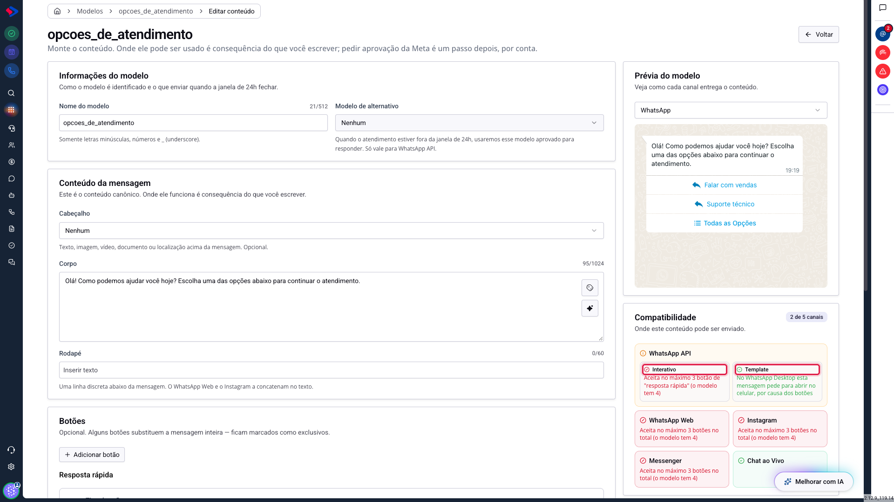
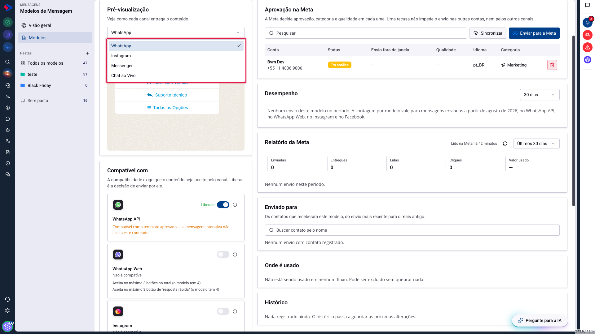

# Um modelo, cinco canais: entendendo a compatibilidade

Nos Modelos de Mensagem, você não escolhe mais o canal antes de escrever. Monta o conteúdo, e o sistema responde onde ele funciona.

Essa inversão é a mudança mais importante do módulo, e é a que mais gera dúvida no começo. Este artigo explica como ler a resposta do sistema, o que fazer quando um canal aparece bloqueado, e por que compatível não é a mesma coisa que liberado.

## Como acessar

O quadro de compatibilidade aparece em dois lugares:

**No construtor**, enquanto você escreve, em **Menu >> Mensagens >> Modelos de Mensagem >> Novo modelo**. Ele reage a cada campo que você preenche.

**Na tela do modelo**, depois de salvo, em **Modelos** e clicando no nome do modelo. Lá ele também permite liberar cada canal.

O número no canto do quadro, "5 de 5 canais", é o resumo: em quantos canais aquele conteúdo cabe. Ele muda enquanto você escreve.

## Quais são os cinco canais

| Canal | O que é |
|---|---|
| **WhatsApp API** | o WhatsApp Oficial, com número verificado pela Meta |
| **WhatsApp Web** | o WhatsApp conectado por leitura de QR Code |
| **Instagram** | mensagens diretas do Instagram |
| **Messenger** | mensagens da sua página do Facebook |
| **Chat ao Vivo** | o widget de chat instalado no seu site |

## Compatível e liberado são coisas diferentes

Esta é a distinção que mais confunde, e vale gravar.

**Compatível** é uma resposta do sistema: o conteúdo que você escreveu cabe naquele canal? Quem responde é o próprio conteúdo, e você não muda isso com um clique. Um modelo com quatro botões não cabe onde só cabem três, e ponto.

**Liberado** é uma decisão sua: você quer que este modelo possa ser enviado por esse canal? Cada canal compatível tem um interruptor, e ele começa desligado nos canais que você ainda não usou.

Por isso um modelo pode estar compatível com o Chat ao Vivo e, ainda assim, não aparecer para o atendente: falta ligar o interruptor. Quando isso acontece, a tela avisa no topo:

Repare no subtítulo: "Enviando em 1 de 2 canais possíveis". Ele compara o que está liberado com o que seria possível.

## Como ler o quadro na tela do modelo

Na tela do modelo, cada canal vira um cartão com o interruptor de liberação e o resultado da análise.

São três situações:

**Verde, com o interruptor ligado**: o canal aceita o conteúdo e você já liberou o envio.

**Cinza, com o interruptor desligado**: pode estar compatível e esperando liberação, ou pode não ser compatível. O texto abaixo do nome do canal diz qual dos dois.

**Âmbar**: o canal serve, mas só de um jeito específico. É o caso do WhatsApp API quando o conteúdo só funciona como template aprovado.

Quando o canal não aceita o modelo, ele mostra o motivo comparando o limite com o que você fez:

> Aceita no máximo 3 botões no total (o modelo tem 4)

Isso é suficiente para decidir: ou tira um botão e ganha o canal, ou mantém os quatro e aceita que aquele canal fica de fora.

## Por que o WhatsApp API aparece com dois modos

O WhatsApp Oficial aceita dois tipos de envio, com regras de botão diferentes. Por isso o cartão dele ocupa espaço dobrado e mostra duas linhas:

**Interativo** é o envio que funciona agora, sem pedir nada a ninguém. Ele aceita **um** tipo de botão por mensagem: ou até três respostas rápidas, ou uma lista, ou um link. Misturar tipos não é permitido.

**Template** é o envio depois da aprovação da Meta. Ele aceita misturar: até dez respostas rápidas, dois links e um telefone na mesma mensagem. Em compensação, lista não existe nesse formato.

Essa separação existe porque juntar os dois numa resposta só enganava. Um modelo com link e resposta rápida, que é combinação legítima em template aprovado, aparecia como incompatível pedindo para "não misturar tipos de botão". Lido de fora, soava como "o seu modelo está errado", quando o modelo está certo e é só o modo interativo que não comporta a mistura.

## Quantos botões cada canal aceita

O número é o máximo daquele tipo de botão. Um traço significa que o canal não tem aquele recurso.

| Botão | WhatsApp API (interativo) | WhatsApp Web | Instagram | Messenger | Chat ao Vivo | Template aprovado |
|---|---|---|---|---|---|---|
| Resposta rápida | 3 | 3 | 3 | 3 | 10 | 10 |
| Lista de opções | 1 | 1 | — | — | 1 | — |
| Acessar site | 1 | 3 | 3 | 3 | 3 | 2 |
| Ligar | — | 1 | — | 1 | 1 | 1 |
| Cancelar promoções | — | 1 | — | 1 | — | 1 |
| Copiar cupom | — | 3 | — | — | 1 | 1 |
| Pagar com PIX | — | 1 | — | — | — | — |
| Pedir localização | — | 1 | — | — | — | — |
| Pedir avaliação | — | — | — | 1 | 1 | — |
| Pedir pagamento | — | — | — | — | — | 3 |

**WhatsApp Web, Instagram e Messenger aceitam no máximo três botões no total**, somando todos os tipos. Um link, um telefone e três respostas rápidas passam na conta por tipo e estouram no total.

## Quais cabeçalhos cada canal aceita

| Canal | Cabeçalhos aceitos |
|---|---|
| WhatsApp API (interativo) | texto, imagem, vídeo, documento |
| WhatsApp Web | texto, localização |
| Instagram | texto |
| Messenger | texto, imagem, vídeo |
| Chat ao Vivo | texto, imagem |
| Template aprovado | texto, imagem, vídeo, documento, localização |

O Instagram é o mais restrito: só aceita cabeçalho de texto. Qualquer mídia no cabeçalho tira esse canal da lista.

## Confira a prévia de cada canal

A mesma mensagem não chega igual em todo lugar. A prévia mostra como o conteúdo aparece para o contato em cada canal, e é o jeito mais rápido de conferir antes de liberar.

## Atenção: no Instagram e no Messenger, o texto chega junto

Existe uma diferença entre o canal recusar o modelo e o canal entregar o conteúdo de outro jeito.

Nesses dois canais, cabeçalho, corpo e rodapé chegam **como um texto só**, e não como três blocos separados. O modelo continua compatível, e o quadro mostra isso como aviso, não como bloqueio.

Isso muda a conta do limite de caracteres: ali o que precisa caber em 640 caracteres é a soma das três partes, e não cada uma delas.

## Dica: acompanhe o contador enquanto escreve

O construtor mostra, embaixo do corpo da mensagem, qual é o limite mais apertado entre os canais em que o modelo cabe. Se você está escrevendo um texto longo e vê "640 caracteres (Instagram)", já sabe quem vai reclamar primeiro.

Escrever olhando esse número evita ter que cortar texto depois, quando a mensagem já está pronta e revisada.

## Conclusão

A regra é simples: escreva o conteúdo primeiro e deixe o sistema dizer onde ele cabe. Se um canal importante ficou de fora, o motivo está escrito no cartão dele, e quase sempre se resolve tirando um botão ou trocando o formato do cabeçalho.

E lembre-se de que compatível não basta. O canal só passa a valer no atendimento depois que você liga o interruptor de liberação.

Em caso de dúvidas, consulte os outros artigos sobre Modelos de Mensagem ou entre em contato com o suporte SprintHub.
