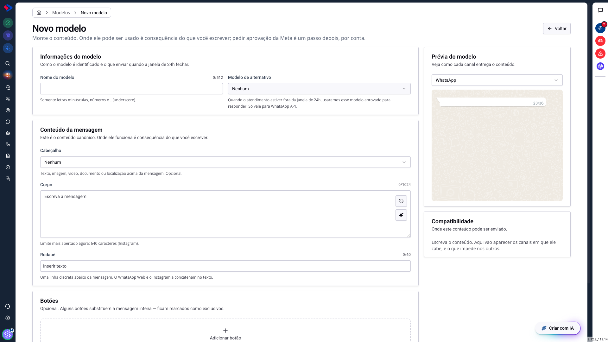
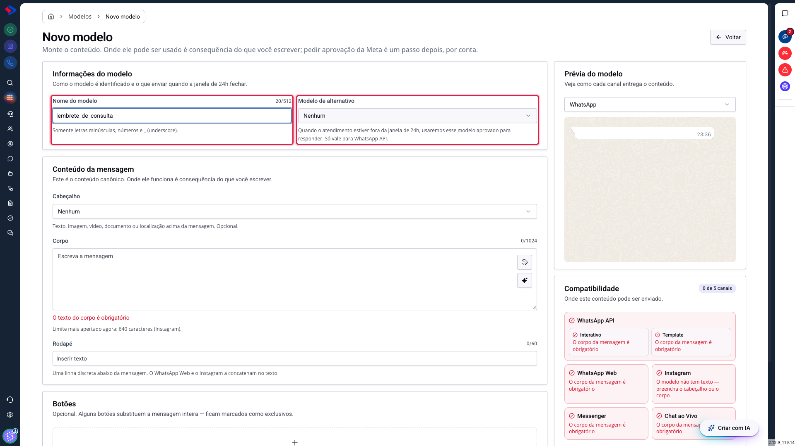
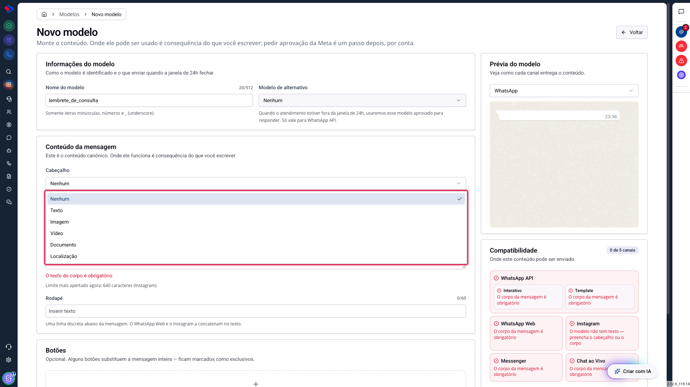
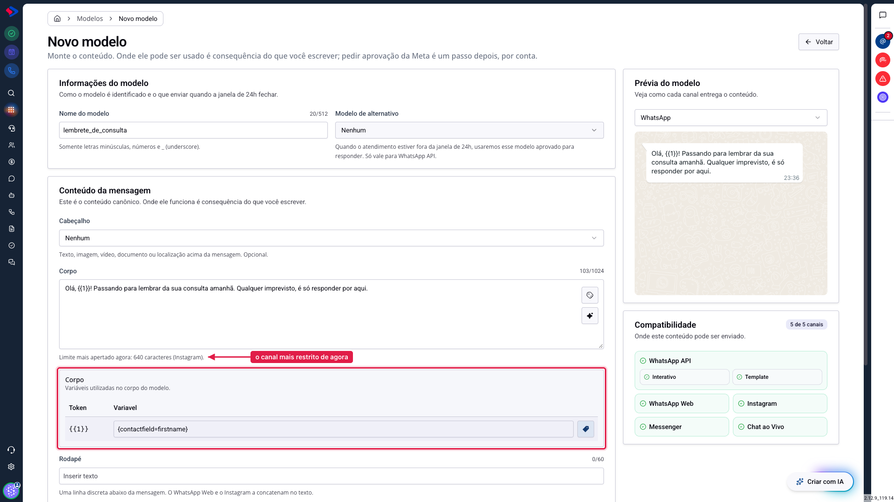
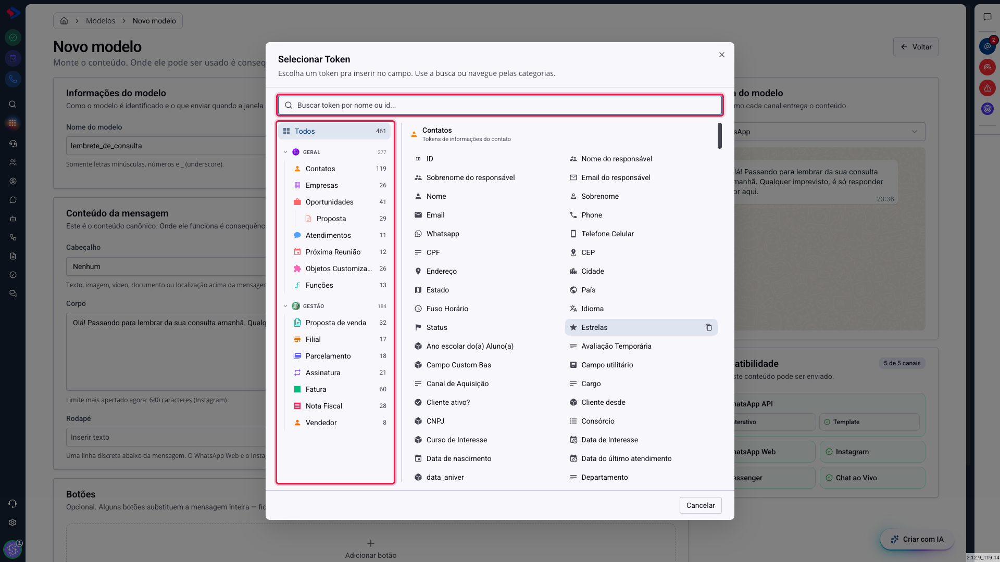
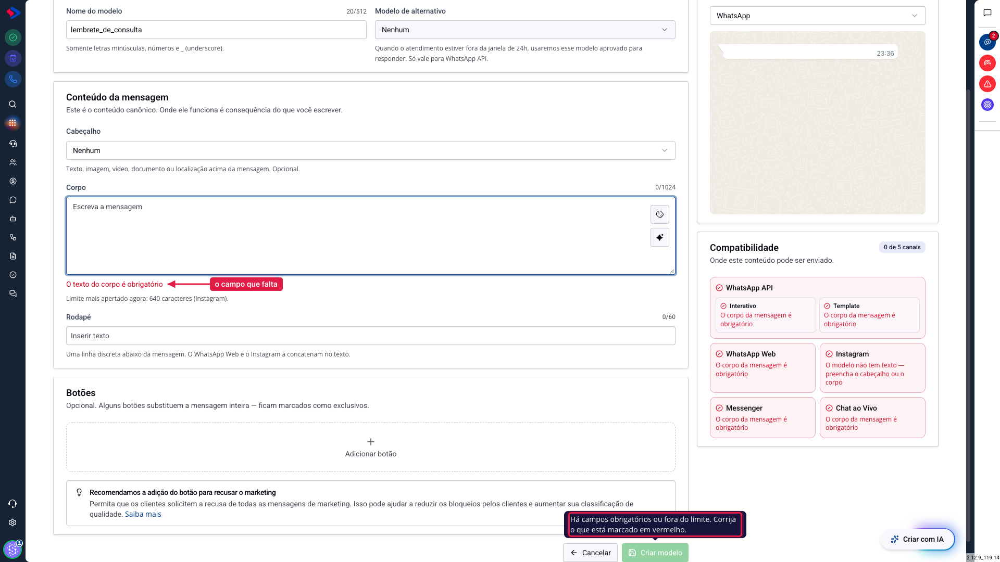

# Como criar um modelo de mensagem

Criar um modelo é escrever uma mensagem uma vez para reaproveitá-la sempre. A mudança desta versão é que você não escolhe mais o canal antes de escrever: monta o conteúdo, e o sistema responde onde ele cabe.

Este artigo percorre o construtor de cima a baixo, campo por campo, e explica os limites que a Meta impõe em cada um.

## Como acessar

Acesse **Menu >> Mensagens >> Modelos de Mensagem >> Modelos** e clique em **Novo modelo**.

A tela tem duas metades. À esquerda ficam os campos; à direita, a prévia do que o contato vai receber e o quadro de compatibilidade, que reage a cada palavra que você digita.

Repare que o botão **Criar modelo** nasce desligado e o quadro da direita diz "0 de 5 canais". Isso é esperado: sem conteúdo, não há onde enviar.

## O nome do modelo

O nome é como o modelo aparece na sua lista e no seletor do atendimento. Ele não é visto pelo contato.

**Só valem letras minúsculas, números e underscore.** Não é escolha do SprintHub, é exigência da Meta para templates aprovados. Escrever "Lembrete de Consulta" não passa; "lembrete_de_consulta" passa.

Vale gastar um minuto pensando no nome. Num catálogo de cinquenta modelos, o atendente acha pelo nome, e prefixos ajudam: `cobranca_primeiro_aviso`, `cobranca_segundo_aviso`, `cobranca_acordo` ficam juntos na lista e se leem como uma sequência.

## O modelo alternativo

Este campo responde a uma pergunta de dinheiro, e por isso merece atenção.

No WhatsApp Oficial existe uma **janela de 24 horas**: depois da última mensagem do contato, você pode responder livremente por 24 horas. Passado esse prazo, a conversa fecha, e só um modelo aprovado pela Meta reabre.

O modelo alternativo é o que será enviado nessa situação. Você escolhe um modelo já aprovado, e quando o atendente tentar responder fora da janela, é ele que sai.

Duas observações: o campo só tem efeito no **WhatsApp API**, porque é o único canal com essa janela, e ele aparece mesmo em modelos que ainda não servem esse canal, porque o canal é consequência do que você escrever depois.

## O cabeçalho

O cabeçalho é opcional e aparece acima da mensagem. São cinco formatos.

**Texto** é uma linha curta, até 60 caracteres, e aceita variável.

**Imagem**, **vídeo** e **documento** pedem um arquivo. Ele precisa ficar acessível por link permanente, porque a Meta baixa o arquivo na hora do envio.

**Localização** envia um mapa, com nome do local, endereço e coordenadas. É o formato mais restrito: só funciona em template aprovado do WhatsApp API.

### Atenção: o cabeçalho é o que mais derruba canal

Cada canal aceita formatos diferentes, e escolher mídia no cabeçalho custa canais:

| Canal | Cabeçalhos aceitos |
|---|---|
| WhatsApp API (interativo) | texto, imagem, vídeo, documento |
| WhatsApp Web | texto, imagem, vídeo, documento |
| Instagram | só texto |
| Messenger | texto, imagem, vídeo |
| Chat ao Vivo | texto, imagem |
| Template aprovado | texto, imagem, vídeo, documento, localização |

O Instagram é o caso mais rígido: qualquer mídia no cabeçalho tira esse canal da lista. Se o Instagram importa para você, deixe o cabeçalho em texto ou não use cabeçalho.

## O corpo

O corpo é o único campo obrigatório, e é o conteúdo da mensagem.

O contador do canto mostra o quanto você usou de **1024 caracteres**, que é o teto do formulário. Mas o número que importa costuma ser outro, e ele aparece logo abaixo do campo: **"Limite mais apertado agora: 640 caracteres (Instagram)"**.

Essa linha diz qual canal é o mais restrito para o conteúdo que você tem agora. Passar dos 640 não trava nada, apenas tira o Instagram da lista. É informação, não proibição: escrever mais e perder um canal continua sendo sua escolha, desde que seja uma escolha consciente.

## As variáveis

Variável é um espaço reservado que o sistema preenche na hora do envio, com o dado daquele contato. É o que transforma uma mensagem só em mil mensagens personalizadas.

Clique no ícone de etiqueta, à direita do campo, para abrir a lista.

São centenas de campos, organizados em duas famílias: **Geral**, com contatos, empresas, oportunidades, atendimentos e reuniões, e **Gestão**, com propostas, faturas, assinaturas, parcelamentos e notas fiscais. A busca do topo acha pelo nome.

Ao escolher, o sistema insere um marcador numerado no texto, `{{1}}`, e cria uma linha na tabela de variáveis abaixo do campo, ligando o número ao dado que vai entrar ali. Se você usar três variáveis, terá `{{1}}`, `{{2}}` e `{{3}}`, na ordem em que aparecem.

### Dica: variável sem contexto é motivo de recusa

A Meta analisa o texto com as variáveis dentro. Uma mensagem que é quase toda variável, como "Olá {{1}}, {{2}} {{3}}", costuma ser recusada, porque a analista não consegue saber o que chega ao contato.

Escreva frases completas em volta das variáveis e use uma variável para cada informação, e não uma para um trecho inteiro.

## O rodapé

O rodapé é uma linha discreta abaixo da mensagem, com até 60 caracteres. Serve para avisos curtos, como "Responda SAIR para não receber mais".

Vale saber que **no WhatsApp Web e no Instagram o rodapé não é um campo separado**: ele é juntado ao texto do corpo e chega como parte da mensagem. O contato vê a mesma informação, só não vê a separação visual.

## Os botões

Os botões ficam no último bloco, e têm artigo próprio nesta documentação, porque a lógica deles é longa. O resumo: você adiciona até dez, alguns tipos só existem em certos canais, e três deles substituem a mensagem inteira.

## Por que o botão de salvar não liga

Quando o **Criar modelo** está desligado, passe o mouse sobre ele: a tela diz o motivo, e são três frases diferentes.

**"Comece pelo nome e pelo corpo da mensagem."** Ninguém digitou nada ainda. Não há erro, só falta conteúdo.

**"Há campos obrigatórios ou fora do limite."** Algo está marcado em vermelho no formulário. No exemplo acima, é o corpo vazio.

**"Este conteúdo não cabe em nenhum canal."** O formulário está válido, mas a combinação que você montou não serve em lugar nenhum. O quadro da direita explica o motivo canal por canal.

Essa terceira situação é a menos óbvia e a mais importante: salvar um modelo assim criaria algo que nunca apareceria em seletor nenhum.

## Depois de salvar

O modelo nasce pronto para os canais em que couber, e você decide em quais liberar o envio. Pedir aprovação da Meta é um passo separado, feito depois, conta por conta.

Ou seja: criar não é publicar. Você pode montar o modelo hoje, revisar amanhã, e só então liberar os canais e enviar para análise.

## Dica: escreva primeiro, ajuste depois

O quadro de compatibilidade recalcula a cada tecla. A forma mais rápida de trabalhar é escrever a mensagem inteira do jeito que você quer e só então olhar o quadro para ver o que ficou de fora.

Ajustar por último costuma custar uma frase mais curta ou um botão a menos. Tentar adivinhar as regras enquanto escreve costuma custar a mensagem inteira.

## Conclusão

O construtor foi desenhado para responder, e não para proibir. Ele deixa você escrever o que quiser e mostra o preço de cada escolha em canais perdidos.

Se um canal importa muito para a sua operação, vale montar o modelo olhando para ele: o Instagram pede cabeçalho de texto e corpo curto, o WhatsApp Web aceita quase tudo.

Em caso de dúvidas, consulte os outros artigos sobre Modelos de Mensagem ou entre em contato com o suporte SprintHub.
