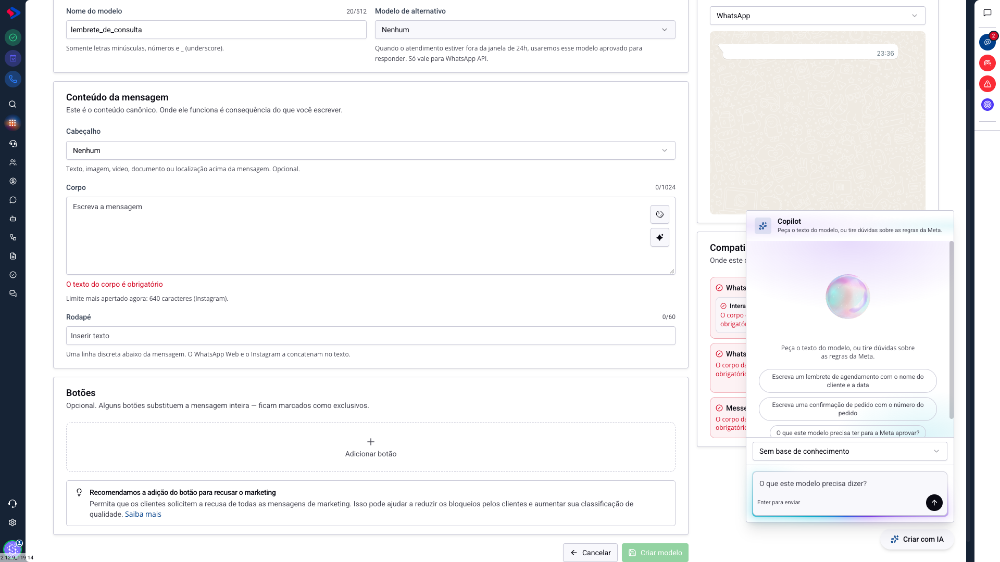
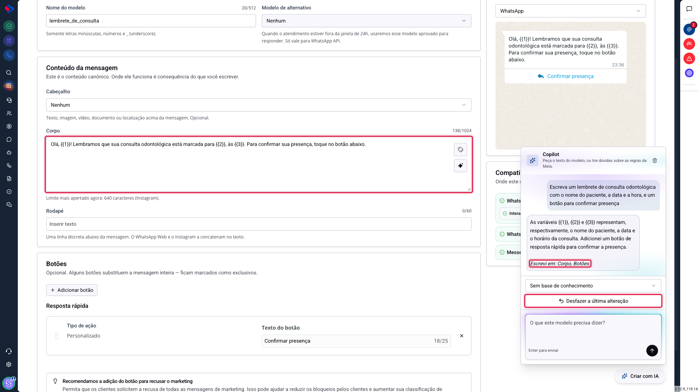
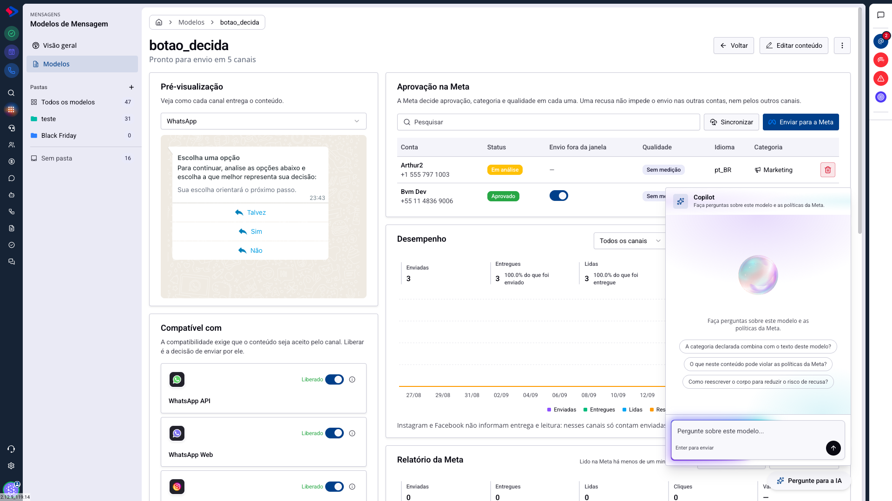
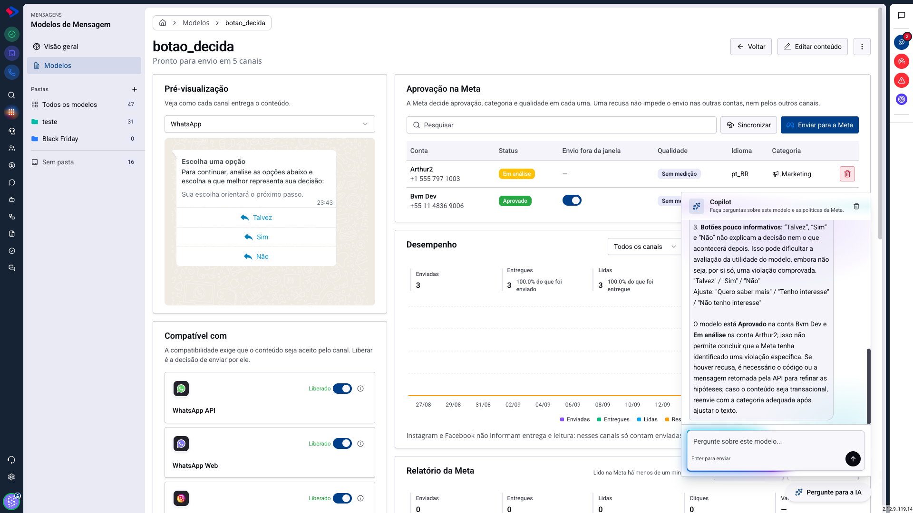

# A inteligência artificial dos Modelos de Mensagem

O módulo tem duas ajudas de IA, e elas fazem coisas diferentes. Uma **escreve** o modelo para você, no construtor. A outra **responde** sobre um modelo que já existe, na tela dele.

Este artigo mostra as duas, o que cada uma pode e não pode fazer, e como desfazer o que a primeira escrever.

## Como acessar

As duas aparecem como um botão flutuante, no canto inferior direito da tela.

**Criar com IA** aparece em **Menu >> Mensagens >> Modelos de Mensagem >> Modelos >> Novo modelo**. Ao editar um modelo que já existe, o mesmo botão se chama **Melhorar com IA**.

**Pergunte para a IA** aparece na tela de um modelo salvo, em **Modelos**, clicando no nome dele.

## A IA que escreve o modelo

Clique em **Criar com IA** e peça o que a mensagem precisa dizer, em português comum.

As três frases prontas servem de exemplo do que esperar: "Escreva um lembrete de agendamento com o nome do cliente e a data", "Escreva uma confirmação de pedido com o número do pedido" e "O que este modelo precisa ter para a Meta aprovar?".

Não é preciso escrever bonito no pedido. Descreva a situação, quem é o contato e o que você quer que ele faça.

### Ela escreve no formulário, não no chat

Esta é a diferença que importa: a resposta não é um texto para você copiar. Os campos do construtor são preenchidos na hora.

No exemplo, um pedido em uma frase virou o corpo da mensagem com três variáveis (nome do paciente, data e hora) e um botão de resposta rápida "Confirmar presença". A prévia à direita já mostra como o contato vai receber.

Como o formulário fica atrás da conversa, a resposta termina dizendo onde ela mexeu: **"Escrevi em: Corpo, Botões."** Assim você sabe o que conferir quando fechar o painel.

### Desfazer está sempre à mão

Abaixo da conversa fica o **Desfazer a última alteração**, e ele volta o rascunho inteiro ao estado anterior, não apenas os campos que a resposta tocou.

Isso deixa o pedido barato: se o resultado não serviu, um clique volta tudo, e você tenta de novo com outras palavras.

### O que ela respeita ao escrever

O texto gerado já sai dentro dos limites da Meta: nome em minúsculas com underscore, cabeçalho e rodapé em 60 caracteres, corpo em 1024, botões com rótulo de até 25 caracteres.

Isso importa mais do que parece. Um corpo de 2.000 caracteres não seria uma sugestão ousada, seria um modelo que não passa, e o construtor acusaria erro em um texto que o próprio painel escreveu.

### Atenção: ela escreve texto, mas não escolhe arquivo

Gerar imagem e escolher a arte da campanha continuam sendo trabalho humano.

O que ela faz, quando você pede uma imagem no cabeçalho, é preparar o campo e abrir um botão dentro da própria conversa, que leva ao gerenciador de arquivos. Você escolhe o arquivo, e ele entra no cabeçalho como se você tivesse preenchido à mão, inclusive para o Desfazer.

**Remover o cabeçalho ela faz.** Pedir "deixe este modelo compatível com todos os canais" pode resultar em tirar a imagem do cabeçalho, porque é isso que o pedido exige, e o quadro de compatibilidade sobe de três para cinco canais.

### Perguntas também são perguntas

Nem todo pedido muda o formulário. "O que este modelo precisa ter para a Meta aprovar?" é uma dúvida, e ela é respondida como dúvida: nada é escrito nos campos.

## A IA que responde sobre o modelo

Na tela de um modelo salvo, o botão **Pergunte para a IA** abre um assistente que conhece aquele modelo: o conteúdo, as variáveis, a categoria declarada, o idioma, o status em cada conta e, quando existe, o código da recusa.

As três perguntas prontas mostram para que ele foi feito:

- **A categoria declarada combina com o texto deste modelo?**
- **O que neste conteúdo pode violar as políticas da Meta?**
- **Como reescrever o corpo para reduzir o risco de recusa?**

### Por que ele existe: a recusa da Meta é um beco sem saída

Quando a Meta recusa um modelo, ela devolve um código, como `INCORRECT_CATEGORY` ou `INVALID_FORMAT`, e nunca diz qual trecho do seu texto causou o problema.

Esse assistente liga uma coisa à outra: ele tem o código e o conteúdo, e aponta o que no seu texto se encaixa naquela política.

Repare no tipo de resposta: ela cita os botões do modelo pelo nome, explica por que "Talvez", "Sim" e "Não" dizem pouco sobre a decisão, e sugere alternativas concretas. Também lê a tabela de aprovação e comenta que o modelo está aprovado numa conta e em análise em outra.

Na tabela de **Aprovação na Meta**, um modelo recusado traz um atalho que abre esse assistente já perguntando sobre a recusa.

## Qual usar em cada caso

| Você quer | Use |
|---|---|
| Escrever um modelo do zero | Criar com IA, no construtor |
| Encurtar, revisar ou melhorar um texto que já existe | Melhorar com IA, ao editar |
| Entender por que a Meta recusou | Pergunte para a IA, na tela do modelo |
| Saber se a categoria declarada está certa | Pergunte para a IA, na tela do modelo |
| Tirar dúvida sobre as regras da Meta | qualquer uma das duas |

## Atenção: quem decide continua sendo você

A IA escreve uma proposta, e ela pode errar o tom da sua marca, inventar um detalhe da operação ou sugerir uma promessa que a empresa não cumpre.

Leia o que foi escrito antes de salvar, principalmente em mensagens de cobrança, de prazo e de preço. O Desfazer existe justamente para que revisar seja mais barato do que aceitar.

## Dica: peça o próximo passo, não só o texto

Os melhores pedidos descrevem a situação inteira. Compare:

- "escreva uma mensagem de cobrança"
- "escreva um aviso de fatura vencida há 3 dias, com o valor e o link de pagamento, em tom cordial, e um botão para falar com o financeiro"

O segundo devolve um modelo pronto para usar. O primeiro devolve um texto genérico que você vai reescrever.

## Conclusão

As duas ajudas cobrem as duas horas difíceis do módulo: a página em branco, na hora de criar, e a recusa sem explicação, depois de enviar.

Nenhuma das duas envia mensagem, altera modelo salvo sem você salvar, ou fala com a Meta por você. Elas escrevem e explicam; o que vai ao ar continua passando por você.

Em caso de dúvidas, consulte os outros artigos sobre Modelos de Mensagem ou entre em contato com o suporte SprintHub.
