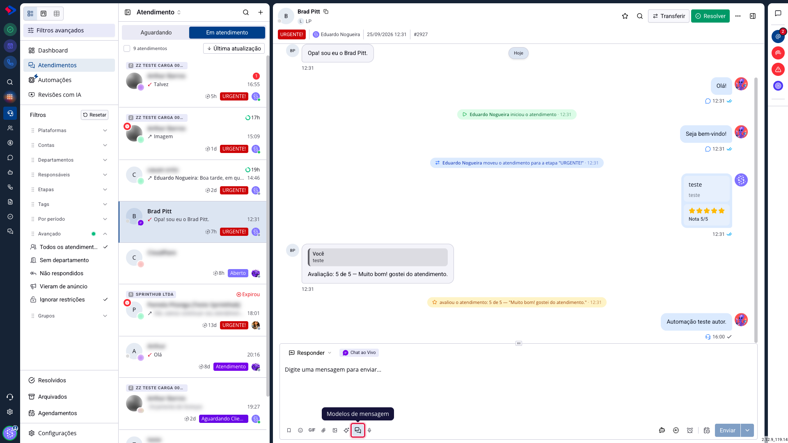
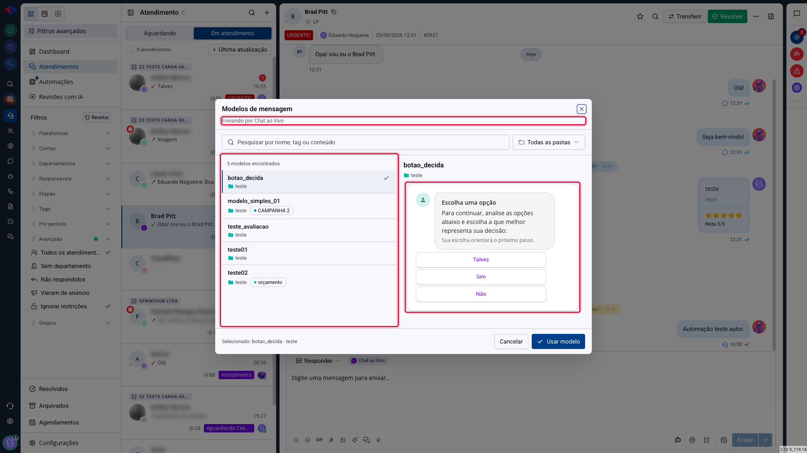

# Como usar um modelo durante o atendimento

Montar bons modelos só vale a pena se o atendente conseguir achar o certo no meio da conversa, com o cliente esperando do outro lado.

Esta atualização refez o seletor de modelos do chat e ampliou os canais em que ele aparece. Este artigo mostra como usá-lo e explica por que alguns modelos aparecem indisponíveis.

## Como acessar

Acesse **Menu >> Atendimento >> SAC 360** e abra uma conversa.

Na barra de digitação, embaixo, clique no ícone de modelos de mensagem.

O seletor abre ocupando a tela, com a lista de um lado e a prévia do outro.

No alto dele, o subtítulo diz por qual canal você está enviando. Isso importa porque a lista já vem recortada: aparecem os modelos liberados para aquele canal, e não o catálogo inteiro.

## O que mudou no seletor

**Ele agora aparece em cinco canais.** Antes existia só no WhatsApp; agora vale também para Instagram, Messenger e Chat ao Vivo. O título do seletor diz por qual canal você está enviando, e a lista já vem recortada para o que funciona nele.

**A tela tem duas colunas.** À esquerda, a lista de modelos; à direita, a prévia do que foi selecionado, exatamente como o contato vai receber. Antes era preciso escolher no escuro e conferir depois de enviar.

**A busca tolera erro de digitação.** Procurar "blackfriday" acha "promocao_black_frideay". Ela olha o nome, a etiqueta, a pasta e também o conteúdo da mensagem, então dá para achar um modelo pelo texto que ele diz, mesmo sem lembrar o nome.

**Dá para filtrar por pasta** no seletor acima da lista, o que ajuda quando o catálogo é grande.

## Por que um modelo aparece indisponível

O seletor mostra também os modelos que não servem naquele canal, marcados como não suportados, em vez de escondê-los.

Isso é proposital: sumir com um modelo que o atendente sabe que existe faz ele procurar, achar que é falha do sistema e abrir chamado. Mostrar com o motivo resolve na hora.

Ao clicar num modelo indisponível, o painel da direita explica o que impede o envio naquele canal. Pode ser um botão que o canal não aceita, um cabeçalho em formato incompatível, ou um modelo que ainda não foi liberado para aquele canal.

## Atenção: falta de permissão não some com o botão

Se a sua equipe não tem permissão para usar modelos naquele canal, o botão continua visível, porém desabilitado, e diz o motivo ao passar o mouse.

Essa mudança foi proposital: botão que desaparece faz quem já usava procurar o que mudou de lugar. Se aparecer assim para você, peça a um administrador a permissão de uso de modelos daquele canal.

Vale lembrar que **as permissões de Chat ao Vivo e Messenger são novas** e ninguém as recebe automaticamente, nem quem já usava modelos no WhatsApp.

## Quando o botão não aparece

Há situações em que a ação não se aplica, e aí o botão realmente não existe:

- o atendimento está arquivado ou encerrado;
- é uma conversa de grupo;
- o canal não trabalha com modelos, como o e-mail e o Mercado Livre.

## Dica: a pesquisa de satisfação chega na conversa

Quando você envia um modelo com botão de avaliação, a nota que o contato dá volta para a mesma conversa, e também fica registrada na linha do tempo do atendimento.

O atendente vê a pergunta que saiu e a resposta que voltou, sem precisar abrir relatório nenhum.

## Conclusão

O seletor novo foi feito para a situação real do atendimento: alguém com pressa, procurando um modelo entre dezenas, com o cliente esperando.

Se a busca não está achando o que você espera, verifique se o modelo está liberado para aquele canal. É a causa mais comum, e ela se resolve na tela do modelo, e não no atendimento.

Em caso de dúvidas, consulte os outros artigos sobre Modelos de Mensagem ou entre em contato com o suporte SprintHub.
