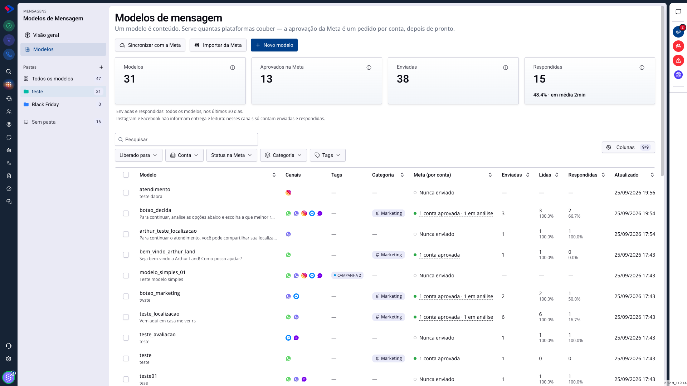
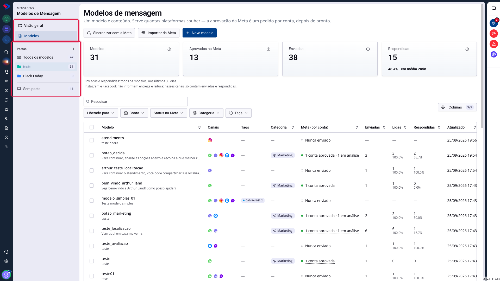
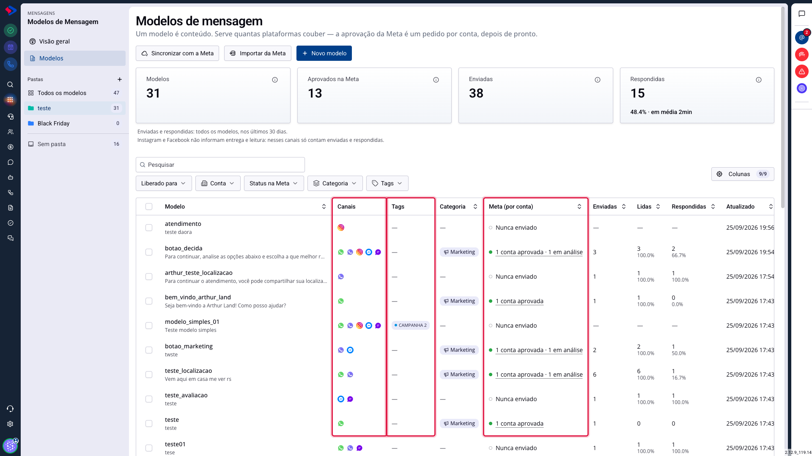
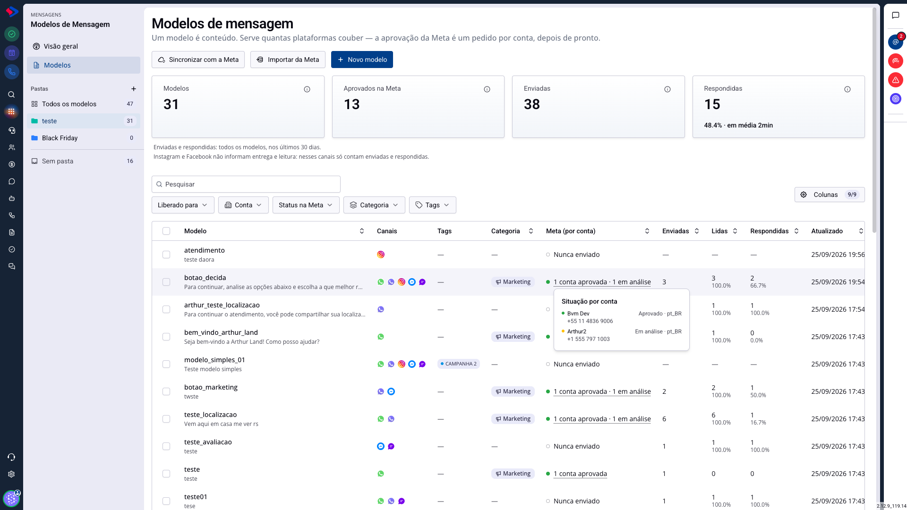
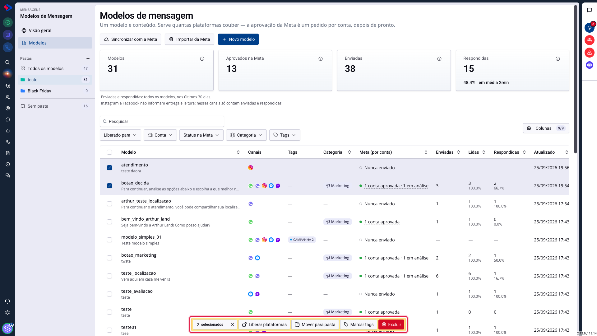
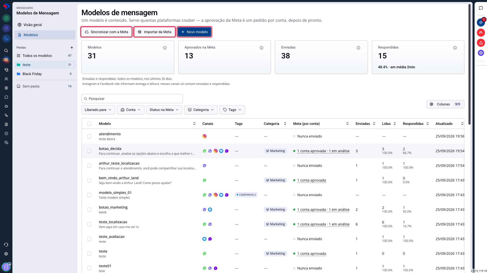
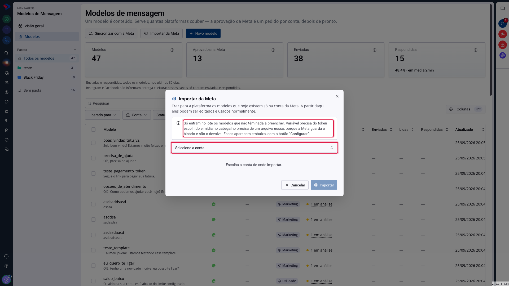
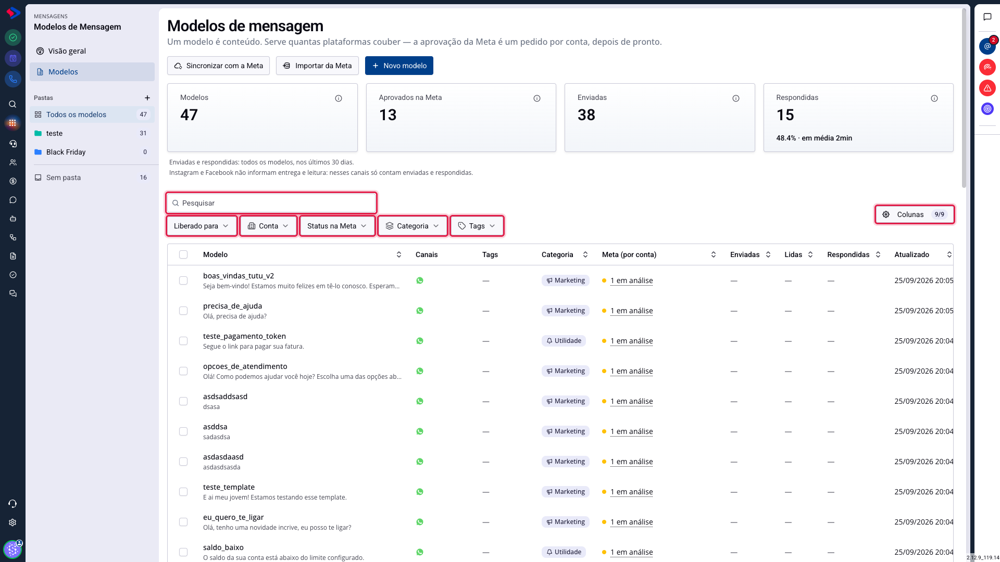

# Modelos de Mensagem: o que mudou

Os Modelos de Mensagem foram reformulados. Se você já usava o módulo, vai notar a mudança logo na primeira tela: antes existiam quatro listas separadas, uma para cada canal, e agora existe uma só.

Este artigo apresenta a tela nova, explica o que mudou de conceito e mostra onde cada coisa foi parar.

## Como acessar

Acesse:

**Menu >> Mensagens >> Modelos de Mensagem**

Ou digite a função no Encontrar Serviços.

## Como a tela está organizada

Na barra lateral, à esquerda, ficam as duas telas do módulo e as suas pastas:

**Visão geral** mostra como os seus modelos vêm se saindo: quantos foram enviados, entregues, lidos e respondidos, nos cinco canais.

**Modelos** é a lista com tudo o que existe cadastrado. É onde você vai passar a maior parte do tempo.

**Pastas** organizam o catálogo. Cada uma mostra quantos modelos tem dentro, e "Sem pasta" reúne o que ainda não foi organizado.

No topo da lista, quatro números resumem a situação: quantos modelos existem, quantos estão aprovados na Meta, quantas mensagens saíram e quantas foram respondidas nos últimos 30 dias.

## Por que quatro listas viraram uma?

Antes, um modelo pertencia a um canal. Se você quisesse a mesma mensagem no WhatsApp e no Instagram, precisava montar duas vezes, em telas diferentes, e manter as duas atualizadas quando o texto mudasse.

Quando um modelo passou a servir vários canais ao mesmo tempo, as quatro listas passaram a mostrar o mesmo modelo em mais de uma delas, sem nada indicando que era o mesmo. Editar por uma mudava, em silêncio, o que aparecia nas outras. Era uma fonte garantida de confusão.

Hoje cada modelo aparece uma vez só, e o canal virou informação dentro da linha, em vez de ser o critério que separa as telas.

**Seus links antigos continuam funcionando.** Quem tinha a lista de Interativos do WhatsApp Web salva nos favoritos cai na lista nova já filtrada por WhatsApp Web, e não numa tela genérica sem recorte.

## As colunas que você precisa conhecer

Três colunas da lista são novas e concentram a informação que antes exigia abrir modelo por modelo.

**Canais** mostra onde aquele modelo já funciona hoje, do jeito que ele está escrito. Os ícones são os cinco canais atendidos: WhatsApp API, WhatsApp Web, Instagram, Messenger e Chat ao Vivo.

Isso mudou de lógica. Você não escolhe mais o canal antes de escrever: monta o conteúdo, e o sistema responde onde ele cabe. Um cabeçalho em vídeo tira o Instagram da lista. Um quarto botão tira os canais que só aceitam três.

**Tags** são as etiquetas do modelo, que servem para marcar campanha, público ou responsável. Um modelo pode ter quantas você quiser.

**Meta (por conta)** mostra a situação da aprovação em cada conta. Esta é a mudança conceitual mais importante do módulo, e merece o próximo tópico.

## Por que a aprovação da Meta agora é por conta

A aprovação deixou de ser uma propriedade do modelo e passou a ser uma propriedade de cada conta.

O motivo é simples: quem aprova é a Meta, e ela analisa cada conta separadamente. Para ela, o mesmo texto enviado por duas contas diferentes são dois pedidos, que podem ter respostas diferentes.

Por isso a coluna mostra uma contagem, e não um selo único. Passe o mouse sobre ela para ver quais contas estão em cada situação:

Cada linha traz o nome da conta, o número de telefone e o idioma da submissão. O número aparece porque o nome costuma se repetir ("Vendas", "Suporte"), e é pelo telefone que a equipe identifica a conta.

No exemplo, o mesmo modelo está aprovado numa conta e em análise em outra, ao mesmo tempo. Isso é normal, e o envio já funciona pela conta aprovada.

## Trabalhar com vários modelos de uma vez

Marque os modelos na primeira coluna e uma barra de ações aparece no rodapé.

São quatro ações:

**Liberar plataformas** autoriza o envio daqueles modelos por um canal, de uma vez.

**Mover para pasta** reorganiza vários modelos sem abrir um por um.

**Marcar tags** aplica ou remove etiquetas em lote.

**Excluir** apaga os selecionados. Essa ação pede confirmação, lista os nomes, exige que você digite EXCLUIR e, ao final, informa quantos saíram de fato. Se algum não puder ser apagado, você fica sabendo quais.

## As ações do topo

**Sincronizar com a Meta** traz a situação atual de todos os modelos. A Meta pode aprovar, reprovar, pausar por qualidade ou trocar a categoria sem avisar, e é este botão que atualiza a tela.

**Importar da Meta** traz para o seu catálogo os modelos que já existem na Meta. Se você tinha modelos aprovados antes de usar o SprintHub, não precisa recriá-los.

**Novo modelo** abre o construtor.

### Como funciona a importação da Meta

Escolha a conta de onde importar, e o sistema traz os modelos que hoje existem só lá. A partir daí eles são editados e usados como qualquer outro.

Repare no aviso: **só entram no lote os modelos que não têm nada a preencher.** Dois casos ficam de fora e aparecem numa lista separada, com um botão **Configurar**:

- modelos com variável, porque é preciso dizer qual dado entra em cada `{{1}}`;
- modelos com mídia no cabeçalho, porque a Meta guarda o arquivo e não o devolve, então é preciso escolher um arquivo seu.

Isso não é limitação do SprintHub, é o que a Meta entrega. Importar o resto automaticamente e pedir ajuda só nesses dois casos é o que deixa a migração rápida sem inventar dado nenhum.

## Como encontrar um modelo na lista

Com o catálogo crescendo, achar o modelo certo vira a tarefa mais frequente. A lista tem quatro caminhos, e eles se combinam.

**A busca** olha o nome e o conteúdo da mensagem. Dá para achar um modelo pelo texto que ele diz, mesmo sem lembrar como ele se chama.

**Os cinco filtros** recortam por **Liberado para** (o canal), **Conta**, **Status na Meta**, **Categoria** e **Tags**. Eles se somam: canal WhatsApp Web mais categoria Marketing mostra só o que atende as duas condições.

**A ordenação** funciona clicando no cabeçalho das colunas. Ordenar por Enviadas acha os modelos que trabalham; ordenar por Atualizado acha o que mudou recentemente.

**O seletor de Colunas**, à direita, liga e desliga colunas da tabela. Quem não usa a Meta pode esconder a coluna de aprovação e ganhar espaço.

E o principal: **a tela lembra as suas escolhas.** Filtros, busca e quantidade de linhas por página ficam guardados no seu usuário e voltam na próxima vez, em qualquer computador. Se você trabalha sempre com um recorte, ele passa a ser o seu ponto de partida.

## O que aconteceu com os modelos "interativos"

"Interativo" deixou de ser um tipo de modelo. Agora é apenas o estado de um modelo que ainda não foi aprovado pela Meta.

Na prática: você não escolhe mais entre criar um "template" ou um "interativo". Cria um modelo, ele já serve os canais onde couber, e pedir aprovação é uma decisão separada, tomada depois, conta por conta.

Isso encurtou o construtor. A tela inicial que pedia canal, tipo, categoria e conta antes de você escrever qualquer coisa não existe mais. Categoria, idioma e conta são perguntados só na hora de enviar para análise, que é quando eles de fato importam.

## Onde foi parar cada coisa

| O que você procurava | Onde está agora |
|---|---|
| Lista de Templates do WhatsApp API | Modelos, filtrada por WhatsApp API |
| Listas de Interativos (WhatsApp API, WhatsApp Web, Instagram) | Modelos, filtradas pelo canal |
| A tela de detalhe por conta | Modelos, clicando no nome do modelo |
| Enviar para a Meta, na ação em massa | Na tela do modelo, no cartão Aprovação na Meta |
| Categoria e idioma, no começo da criação | No momento de enviar para análise |
| O gerenciador que abria pela engrenagem da barra superior | Removido; tudo está no módulo |

## O que é novo

Além da reorganização, a atualização trouxe recursos que não existiam:

**Pastas e etiquetas** para organizar o catálogo, com cor e ordem definidas por você.

**Botões novos**: pagar com PIX, pedir pagamento, pedir localização e pedir avaliação, além do cupom de desconto.

**Controle de acesso por modelo**, para restringir quais usuários e departamentos enxergam e usam cada um.

**Visão geral com os números dos cinco canais**, e não só os da Meta. A tela antiga só lia dados da Meta e mostrava zeros para quem não tinha os relatórios dela ligados.

**Modelos no Chat ao Vivo e no Messenger**, que antes não tinham esse recurso.

**Tela de detalhe por modelo**, reunindo prévia por canal, compatibilidade, aprovação, desempenho, para quem foi enviado, onde é usado e histórico de alterações.

## Atenção: as permissões novas começam vazias

Seis permissões nasceram com esta atualização, e ninguém as recebe automaticamente, nem quem já usava o módulo:

- enviar modelo para análise da Meta;
- sincronizar com a Meta;
- gerenciar o acesso de um modelo;
- organizar em pastas e etiquetas;
- usar modelos no Chat ao Vivo;
- usar modelos no Messenger.

Se um botão aparecer desabilitado para a sua equipe logo depois da atualização, é provável que seja isso. Um administrador precisa conceder a permissão aos grupos, em Configurações.

## Conclusão

A mudança de fundo é uma só: o modelo virou conteúdo, e o canal virou consequência. Você escreve uma vez, e o sistema diz onde aquilo funciona.

Se você tinha o hábito de manter versões paralelas da mesma mensagem para canais diferentes, vale revisar o catálogo. É provável que várias delas possam virar um modelo só, o que reduz o trabalho de manutenção e o risco de as versões ficarem diferentes entre si.

Em caso de dúvidas, consulte os outros artigos sobre Modelos de Mensagem ou entre em contato com o suporte SprintHub.
