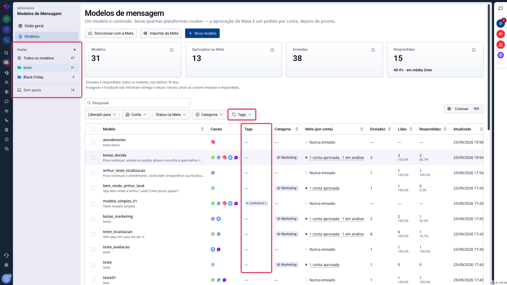
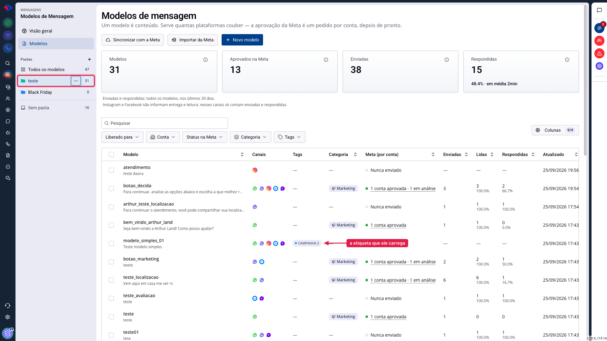
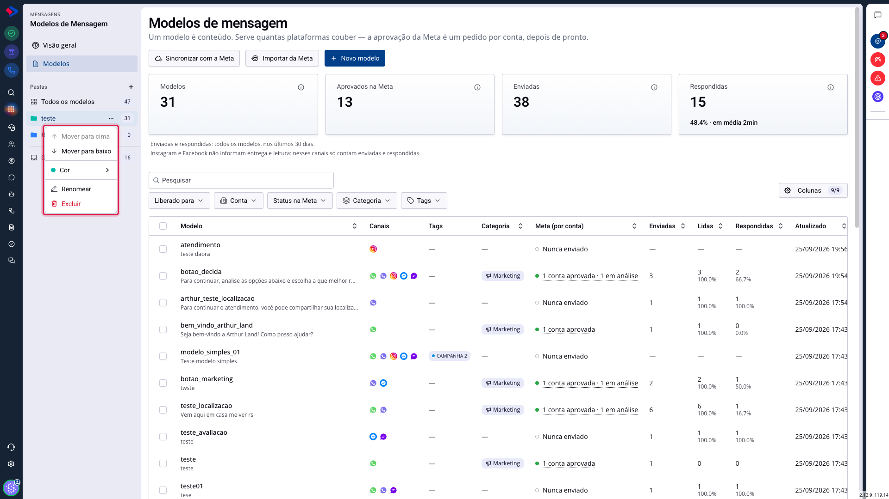
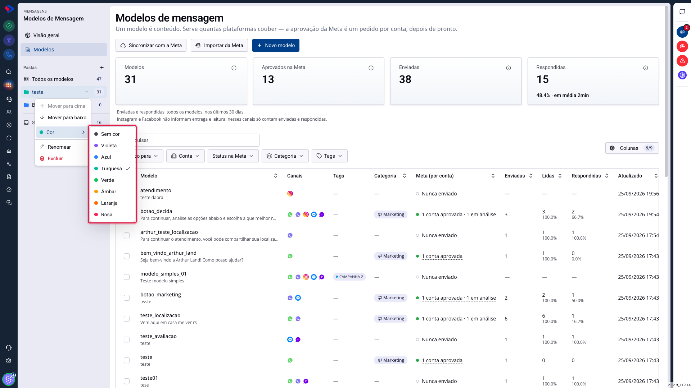

# Pastas e etiquetas: como organizar seus modelos

Quando o catálogo passa de algumas dezenas de modelos, achar o certo na hora do atendimento vira problema. A atualização dos Modelos de Mensagem trouxe duas formas de organizar: pastas e etiquetas.

Elas parecem a mesma coisa e não são. Escolher errado significa refazer a organização depois, então vale entender a diferença antes de começar.

## Como acessar

Acesse **Menu >> Mensagens >> Modelos de Mensagem** e clique em **Modelos**.

As pastas ficam na barra lateral, à esquerda. As etiquetas aparecem como uma coluna da lista e como um filtro acima dela.

## Qual a diferença entre pasta e etiqueta?

A diferença que resolve quase toda dúvida é esta: **um modelo fica em uma pasta só, mas pode ter quantas etiquetas você quiser.**

**Pasta é lugar.** É onde o modelo mora. Pense nela como a gaveta do arquivo: um documento está numa gaveta ou em outra, nunca nas duas. Por isso a pasta é boa para separar grandes áreas que não se misturam, como Cobrança, Boas-vindas e Pós-venda.

**Etiqueta é característica.** É uma marca que você cola no modelo, e ele pode receber várias. Por isso a etiqueta é boa para atravessar as áreas: uma campanha específica, uma sazonalidade, o time que usa aquele modelo.

Na prática, você usa as duas juntas. O modelo "desconto_black_friday" pode morar na pasta **Promoções** e carregar as etiquetas **Black Friday** e **E-commerce**. Quando a Black Friday passar, você tira a etiqueta e o modelo continua na mesma pasta, onde sempre esteve.

### Exemplos de uso

**Use pasta quando** a divisão for estável e exclusiva:

- separar modelos por área: Cobrança, Suporte, Vendas;
- separar por etapa do relacionamento: Primeiro contato, Acompanhamento, Pós-venda;
- guardar o que não está em uso: Arquivo, Descontinuados.

**Use etiqueta quando** a marca for temporária ou puder se acumular:

- identificar uma campanha: Black Friday, Natal, Aniversário da loja;
- marcar o público: Cliente novo, Cliente antigo, Inadimplente;
- marcar o responsável: Time de Vendas, Time de Suporte.

## Como criar uma pasta

Clique no **+** ao lado da palavra **Pastas**, na barra lateral, digite o nome e confirme. A pasta nasce vazia e sem cor.

Para colocar modelos nela, você tem dois caminhos:

**Um a um**: abra o modelo e escolha a pasta na tela dele.

**Vários de uma vez**: na lista, marque os modelos que quer mover, e use a barra de ações que aparece no topo para escolher a pasta de destino.

## O que dá para fazer com uma pasta

Passe o mouse sobre uma pasta na barra lateral e clique nos três pontos que aparecem ao lado do nome.

**Mover para cima e Mover para baixo** mudam a ordem das pastas na barra. A ordem é sua: coloque em cima as que a equipe usa todo dia. Na primeira pasta, "Mover para cima" fica desabilitado, e o mesmo vale para "Mover para baixo" na última.

**Cor** pinta o ícone da pasta. São sete cores, mais "Sem cor", que é como toda pasta nasce.

A cor não é enfeite: numa barra com dez pastas, o olho acha "Cobrança" pela mancha laranja antes de ler o nome. Por isso vale usar cor com critério, e não pintar todas. Se tudo é colorido, nada se destaca.

**Renomear** troca o nome, sem mexer nos modelos que estão dentro.

**Excluir** apaga a pasta. Os modelos que estavam nela **não são apagados**: voltam para "Sem pasta", e continuam funcionando normalmente em chatbots, automações e atendimentos. A tela avisa quantos modelos foram soltos.

## O que é "Sem pasta"?

É onde ficam os modelos que ninguém organizou ainda. Ela aparece separada das outras por uma linha, no fim da barra, porque não é uma pasta que você criou: é o resto.

Se você está começando a organizar um catálogo antigo, é dali que vale partir. A contagem ao lado do nome mostra quanto ainda falta.

## Como usar as etiquetas

As etiquetas são as mesmas que você já usa nos contatos, então a lista delas é compartilhada com o resto do sistema. Isso evita ter "Black Friday" cadastrado três vezes com grafias diferentes.

Para aplicar, marque um ou mais modelos na lista e use a ação de etiquetas na barra que aparece no topo. Para filtrar, use o filtro **Tags** acima da lista.

O filtro de etiquetas é **OU**, e não E: pedir "Black Friday" e "Natal" traz os modelos que têm qualquer uma das duas, e não só os que têm as duas juntas. Isso é proposital, porque etiqueta é assunto, e exigir todos ao mesmo tempo esconderia justamente o que você procura.

## Dica: a pasta escolhida vai para o endereço

Quando você clica numa pasta, o endereço da página muda junto. Isso significa que dá para salvar o link da pasta nos favoritos, ou mandar para um colega, e ele abre direto no mesmo recorte.

## Conclusão

Pasta é lugar e etiqueta é característica. Se a pergunta for "onde este modelo mora?", a resposta é pasta. Se for "o que este modelo é?", a resposta é etiqueta.

Comece pelas pastas, que dão a estrutura, e use etiquetas para o que atravessa essa estrutura. Um catálogo bem organizado se nota na hora do atendimento, quando o atendente acha o modelo certo sem precisar rolar a lista inteira.

Em caso de dúvidas, consulte os outros artigos sobre Modelos de Mensagem ou entre em contato com o suporte SprintHub.
