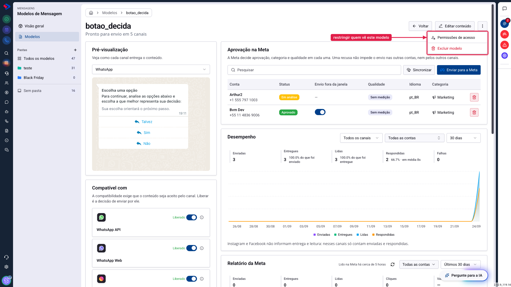
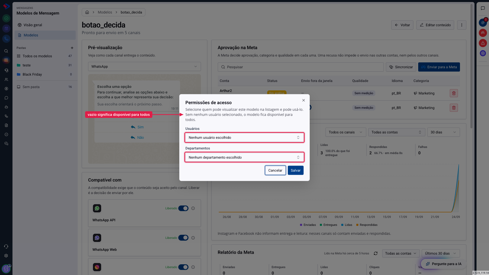

# Quem pode ver e usar cada modelo

A atualização dos Modelos de Mensagem trouxe dois controles diferentes, e vale entender a diferença antes de sair configurando:

**As permissões do sistema** dizem o que cada grupo de usuários pode fazer no módulo: criar, editar, excluir, enviar para a Meta.

**O acesso por modelo** diz quais pessoas enxergam e podem usar um modelo específico.

O primeiro é configurado uma vez, por perfil de usuário. O segundo é configurado modelo a modelo, e só quando você precisa restringir algum.

## Como acessar

As **permissões do sistema** ficam em **Menu >> Configurações >> Usuários**, no grupo de permissões de cada perfil.

O **acesso por modelo** fica dentro do próprio modelo: em **Menu >> Mensagens >> Modelos de Mensagem >> Modelos**, abra um modelo e clique nos três pontos no canto superior direito.

## Atenção: seis permissões novas começam vazias

Esta é a informação mais importante do artigo, e a que mais gera chamado logo depois da atualização.

Seis permissões nasceram com esta versão. Elas **não** são concedidas automaticamente, nem para quem já usava o módulo antes:

- **Enviar para análise da Meta**
- **Sincronizar com a Meta**
- **Gerenciar permissões de acesso** do modelo
- **Organizar em pastas e etiquetas**
- **Usar modelos no Chat ao Vivo**
- **Usar modelos no Messenger**

Se um botão aparecer desabilitado para a sua equipe logo depois da atualização, é quase certo que seja isso. Um administrador precisa conceder essas permissões aos grupos, em **Configurações do sistema >> Grupos de usuários**.

Administradores não são afetados: eles já têm tudo.

### Permissão negada é diferente de plano sem acesso

São duas mensagens parecidas e com soluções diferentes.

**Botão desabilitado, ou tela que diz que falta permissão**: o seu perfil não recebeu aquela permissão. Quem resolve é um administrador da sua empresa, em Configurações.

**Aviso de plano sem acesso, com cadeado no item do menu**: o módulo não está contratado no seu plano. Nenhum administrador da sua empresa resolve isso pelas configurações; é preciso falar com o suporte SprintHub.

Se o item "Modelos" aparecer bloqueado para todo mundo, inclusive para administradores, é o segundo caso.

## Como as permissões foram reorganizadas

Antes, as permissões do módulo eram divididas por canal e por tipo de modelo. Havia "Criar" repetido em quatro lugares, e a divisão não fazia mais sentido depois que um modelo passou a servir vários canais.

Agora elas estão organizadas em dois eixos:

**Gerir o catálogo**, que trata do que se pode fazer com os modelos:

| Permissão | O que libera |
|---|---|
| Visualizar | ver a listagem e abrir um modelo |
| Visão geral | ver a tela de números |
| Criar | criar modelos novos |
| Editar | alterar modelos existentes |
| Excluir | apagar modelos |
| Enviar para análise | pedir aprovação à Meta |
| Sincronizar com a Meta | atualizar a situação vinda da Meta |
| Gerenciar acesso | definir quem vê cada modelo |
| Organizar | mexer em pastas e etiquetas |

**Usar no atendimento**, que trata de enviar modelo numa conversa, e é separado por canal: WhatsApp API, WhatsApp Web, Instagram, Messenger e Chat ao Vivo.

Essa separação permite, por exemplo, que um atendente use modelos no WhatsApp sem poder criar ou apagar nada, e que alguém do marketing monte o catálogo sem atender.

### O que saiu

As permissões de **Exportar**, **Construtor**, as duas de **Insights** e as antigas divididas por canal foram removidas. As telas de criação e edição passaram a responder pelas permissões de Criar e Editar, que é o que elas realmente fazem.

## O acesso por modelo

Serve para quando um modelo específico não deve ficar visível para todo mundo. Uma tabela de preços que só o comercial usa, um modelo de cobrança que só o financeiro dispara.

Para configurar, escolha **Permissões de acesso** no menu de três pontos do modelo.

Você escolhe **usuários**, **departamentos**, ou os dois. Ao escolher um departamento, aparece a opção de incluir também os subdepartamentos.

**A regra mais importante: sem ninguém escolhido, o modelo fica disponível para todos.** Duas listas vazias significam "todo mundo", e não "ninguém". É o contrário do que muita gente espera, e por isso a frase aparece escrita no próprio diálogo.

Quando você restringe um modelo, ele some da listagem para quem não tem acesso, e também do seletor durante o atendimento. Para essas pessoas, é como se ele não existisse.

## Dica: restrinja pouco

Restrição de acesso resolve casos reais, mas cobra um preço: modelo que não aparece gera a dúvida "onde foi parar aquele modelo?", e quem responde é o suporte interno.

Use quando houver motivo claro, como informação sensível ou risco de a mensagem errada sair para o cliente errado. Para o resto, organizar em pastas costuma resolver melhor do que esconder.

## Conclusão

Permissão de sistema é sobre o que a pessoa pode fazer; acesso por modelo é sobre o que ela pode ver.

Depois de atualizar, o primeiro passo é revisar os grupos e conceder as seis permissões novas para quem precisa delas. Sem isso, parte da equipe vai encontrar botões desabilitados sem entender por quê.

Em caso de dúvidas, consulte os outros artigos sobre Modelos de Mensagem ou entre em contato com o suporte SprintHub.
