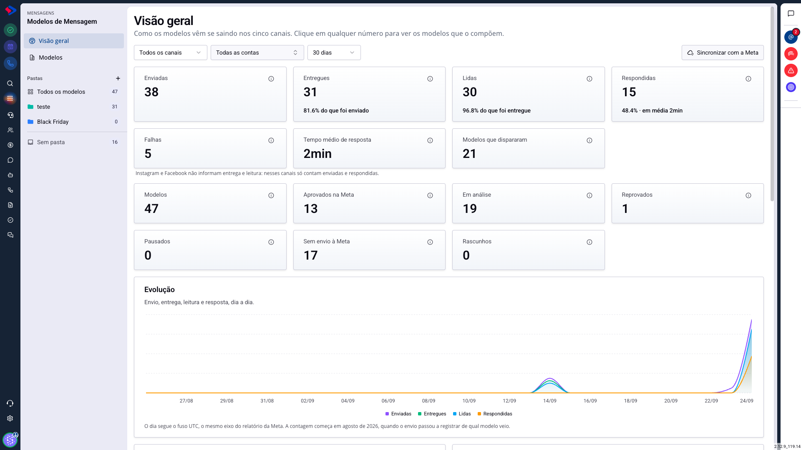
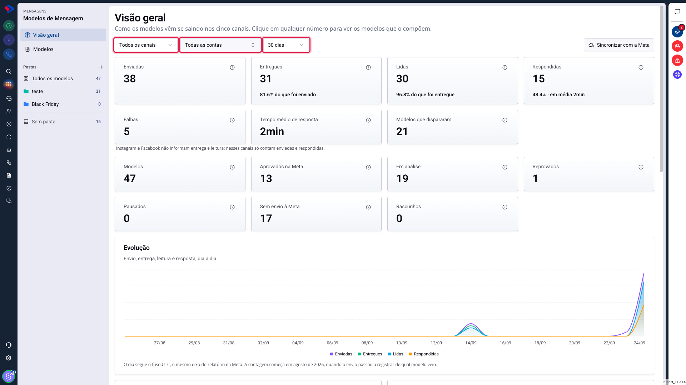
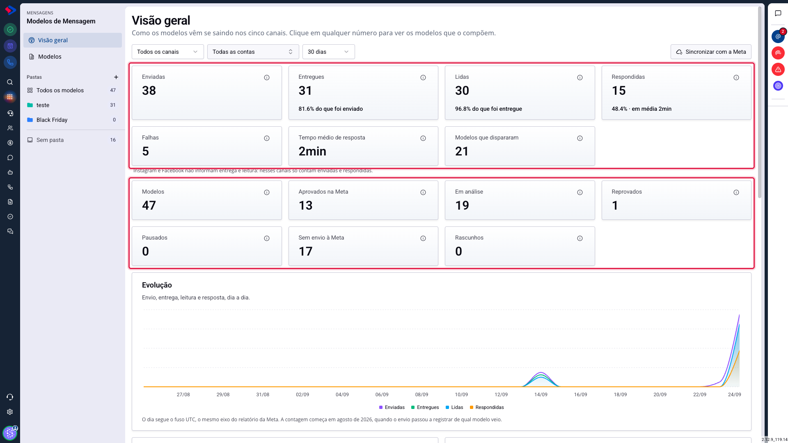
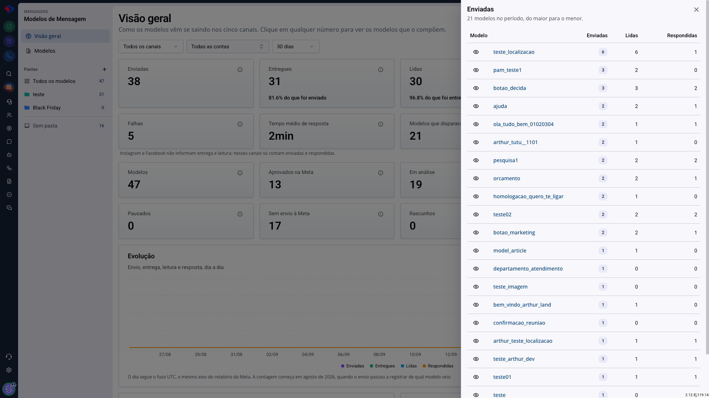

# A Visão geral: como ler os números dos seus modelos

A Visão geral responde a pergunta que todo gestor faz sobre os modelos de mensagem: eles estão funcionando?

A tela anterior só conseguia responder isso para o WhatsApp Oficial, porque lia os dados direto da Meta. Quem não tinha os relatórios dela ligados via zeros. Agora os números vêm dos nossos próprios dados e cobrem os cinco canais.

## Como acessar

Acesse **Menu >> Mensagens >> Modelos de Mensagem** e clique em **Visão geral**, na barra lateral.

## Os filtros valem para a tela inteira

No topo ficam três recortes: **canal**, **conta** e **período**.

Trocar qualquer um deles atualiza todos os números e gráficos de uma vez, o que evita a armadilha de comparar um cartão filtrado com outro que não está.

Os períodos disponíveis são 7, 30 e 90 dias. O filtro de conta só afeta os números que vêm da Meta; os canais que não dependem dela continuam contando igual.

## As duas faixas de números

A tela tem duas faixas, e elas respondem perguntas diferentes. A de cima fala do que foi **enviado** no período; a de baixo fala do seu **catálogo**, independente de envio.

## A primeira faixa: como as mensagens se saíram

Estes números falam do que foi enviado no período escolhido.

**Enviadas**: quantas mensagens saíram a partir de um modelo.

**Entregues**: quantas chegaram ao aparelho do contato, com a porcentagem sobre o que foi enviado. Queda aqui costuma significar número inválido ou contato que bloqueou.

**Lidas**: quantas foram abertas, com a porcentagem sobre o que foi entregue.

**Respondidas**: quantas geraram resposta do contato, com a taxa e o tempo médio até a resposta. É o número que mais diz sobre a qualidade do conteúdo: mensagem que ninguém responde costuma ser mensagem que não pede nada.

**Falhas**: envios que não completaram.

**Tempo médio de resposta**: quanto o contato demora, em média, para responder.

**Modelos que dispararam**: quantos modelos diferentes foram usados no período. Comparar este número com o total do catálogo mostra quanto do que você mantém está de fato em uso.

### Atenção: Instagram e Messenger não informam entrega e leitura

Esses dois canais não devolvem essa informação. Quando o filtro incluir um deles, as colunas de entrega e leitura contam menos do que a realidade, e a tela avisa isso logo abaixo dos cartões.

Se você quer avaliar entrega e leitura com precisão, filtre por WhatsApp API ou WhatsApp Web.

## A segunda faixa: a situação do catálogo

Estes números falam dos modelos cadastrados, e não dos envios.

**Modelos**: o total do catálogo.

**Aprovados na Meta**: quantos têm pelo menos uma conta aprovada.

**Em análise**: quantos esperam resposta da Meta neste momento.

**Reprovados**: quantos foram recusados e precisam de ajuste.

**Pausados**: quantos a Meta pausou por qualidade. Esse é o número que costuma passar despercebido, porque a pausa acontece sem aviso e o modelo simplesmente para de sair.

**Sem envio à Meta**: quantos nunca foram submetidos. Não é problema: são os modelos que funcionam nos canais que não dependem de aprovação.

**Rascunhos**: modelos começados e não terminados.

## Cada número abre a lista que o formou

Este é o recurso mais útil da tela, e o menos óbvio: **todo número é clicável**.

Ao clicar, abre uma gaveta com os modelos que compõem aquele número, ordenados do maior para o menor, com as métricas de cada um.

Isso transforma um número em diagnóstico. "38 enviadas" não diz o que fazer; a lista mostra que três modelos concentram metade dos envios, e que um deles tem taxa de resposta muito abaixo dos outros.

Na gaveta, o ícone de olho abre a prévia do modelo, e clicar no nome leva para a tela dele.

## Dica: procure o que não está sendo usado

Compare **Modelos** com **Modelos que dispararam**. A diferença é o catálogo parado.

Catálogo grande demais atrapalha o atendimento: quanto mais modelo na lista, mais tempo o atendente leva para achar o certo. Se há dezenas de modelos sem uso há 90 dias, vale arquivar em uma pasta separada ou excluir.

## Conclusão

A Visão geral serve para duas perguntas diferentes: a primeira faixa responde "as mensagens estão funcionando?", e a segunda responde "meu catálogo está em ordem?".

O hábito que mais rende é clicar nos números em vez de só olhar. O total diz que algo aconteceu; a lista por trás dele diz o que fazer a respeito.

Em caso de dúvidas, consulte os outros artigos sobre Modelos de Mensagem ou entre em contato com o suporte SprintHub.
